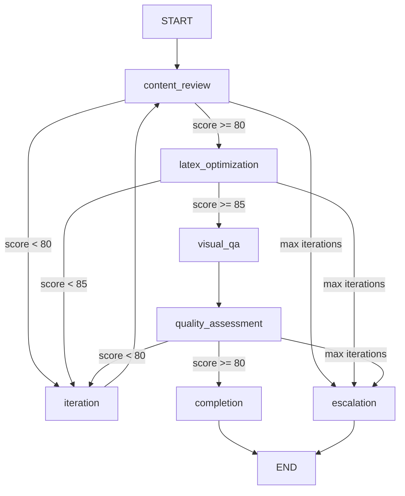

# DeepAgents PrintShop - Intelligent LaTeX Document Generator

[](LICENSE)
[](https://python.org)
[](https://github.com/langchain-ai/langgraph)
[](https://pypi.org/project/deepagents-cli/)

An advanced multi-agent system that generates professional LaTeX documents with comprehensive quality assurance, LLM-based document optimization, and automated visual quality analysis. Orchestrated by a **LangGraph StateGraph** with quality gates, iterative refinement, and inter-agent communication.

## Example Output

The system generates two types of professional documents:

### Research Report
A professional academic-style research report with tables, figures, TikZ diagrams, and citations.

**Features:**
- Cover page disclaimer stating content is fictitious sample data
- Auto-generated table of contents matching the config manifest
- Data tables rendered from CSV files
- Performance comparison charts
- TikZ vector diagrams (neural network architecture)
- "Typeset by DeepAgents PrintShop" attribution

[View sample PDF](deepagents-printshop-SAMPLE-research_report.pdf) (~217KB, 10 pages) | [View pipeline walkthrough](docs/pipeline-walkthrough/PIPELINE_WALKTHROUGH.md)

### Magazine
A full-color magazine layout with multi-column text, pull quotes, and professional typography.

**Features:**
- Full-page cover with background image
- Creative table of contents with large section numbers
- Two-column article layouts with drop caps
- Pull quotes and infographic statistics
- Dark sections with inverted colors
- Back cover with barcode and issue/price info
- "Generated by DeepAgents PrintShop" attribution

[View sample PDF](deepagents-printshop-SAMPLE-magazine.pdf) (~7MB, 10-15 pages)

> **Note:** All generated documents include a disclaimer stating they contain fictitious sample content created for demonstration purposes.

### LangGraph Pipeline Architecture

The QA pipeline is orchestrated as a **LangGraph StateGraph** with conditional edges for quality gate decisions:



Inter-agent communication flows through a shared `agent_context` dict — each node can read upstream notes and write downstream context for smarter decision-making.

## Recommended: Run with Claude Code

This project is designed to work seamlessly with **[Claude Code](https://claude.ai/code)** (Anthropic's agentic coding tool). Claude Code can:

- Run the full QA pipeline and monitor progress
- Automatically debug LaTeX compilation errors
- Iterate on document quality issues
- Make real-time adjustments to generated content
- Handle the multi-step workflow naturally

Simply open this project in Claude Code and ask it to "run the magazine pipeline" or "generate a research report" - it will handle the rest.

### Practical Example: Publishing Your Own Content

Instead of just running the sample documents, you can use Claude Code to publish your own research or content:

**Example prompt:**
> "I have research notes about machine learning model evaluation in my `~/research/ml_evaluation/` folder. Create a new PrintShop content source from these files and generate a professional PDF report."

Claude Code will:
1. Read your source files and understand the content structure
2. Create `artifacts/sample_content/ml_evaluation/` with properly organized content
3. Generate a `config.md` with appropriate metadata and content manifest
4. Convert your notes into structured markdown sections
5. Import any data tables as CSV files
6. Run the full QA pipeline to generate a polished PDF

**Other practical prompts:**
- "Convert my thesis draft into a properly formatted research report"
- "Take these meeting notes and create a professional magazine-style newsletter"
- "Format my API documentation into a technical report with code examples"

## Important Notice

**Disclaimer**: This software is provided "as-is" without warranty of any kind. The author is not liable for any damages or issues arising from the use of this software.

**Security Warning**: This project uses third-party packages and AI services (Claude API). Before using this software, especially in scenarios involving confidential data or private information:
- Review all third-party dependencies in `requirements.txt`
- Understand that content is sent to external LLM APIs (Anthropic Claude)
- Conduct your own security assessment for your use case
- Never process sensitive, proprietary, or confidential information without proper security measures
- Consider running in an isolated environment for sensitive workflows

By using this software, you acknowledge these risks and agree to conduct appropriate due diligence.

## Features

### Core Capabilities
- **LLM-Based LaTeX Generation**: Intelligent document creation with Claude Sonnet
- **Content-Driven References**: Inline `<!-- IMAGE: -->`, `<!-- CSV_TABLE: -->`, and `<!-- TIKZ: -->` comments in markdown are converted to LaTeX figures, tables, and diagrams
- **Content Type System**: Document types (`content_types/`) define rendering instructions, structure rules, and LaTeX requirements in natural language
- **Self-Correcting Compilation**: Automatic error detection and fix generation
- **Unicode Sanitization**: Automatic replacement of Unicode math characters with LaTeX equivalents for pdflatex compatibility
- **Multi-Agent QA Pipeline**: Automated quality assurance with specialized agents
- **Visual Quality Analysis**: AI-powered PDF layout and typography analysis
- **Iterative Refinement**: Progressive quality improvement over multiple passes
- **Version Tracking**: Complete change history with diff generation
- **Pattern Learning System**: Learns from version history to improve future documents

### Document Features
- Professional LaTeX reports with customizable structure
- Automatic table of contents driven by `config.md` manifest
- Data tables from CSV files via inline references
- Image placement via inline references
- TikZ vector diagrams via inline references
- PDF compilation with pdflatex
- Hyperlink and cross-reference support
- Cover page disclaimers and production citations from content type definitions


### Agent Nodes & Tools

| Node | Agent | Tools Used | LLM Calls |
|------|-------|------------|-----------|
| **ContentReview** | ContentEditorAgent | `ContentReviewer`, `VersionManager`, `ChangeTracker` | Claude Sonnet (grammar/readability analysis) |
| **LaTeXOptimization** | LaTeXSpecialistAgent | `LaTeXAnalyzer`, `LaTeXOptimizer`, `LLMLaTeXGenerator`, `PDFCompiler` | Claude Sonnet (LaTeX generation, syntax fixing, self-correction) |
| **VisualQA** | VisualQAFeedbackAgent | `PDFToImageConverter`, `VisualValidator`, `MultimodalLLMAnalyzer`, `LLMLaTeXGenerator`, `PDFCompiler` | Claude Haiku Vision (page analysis), Claude Sonnet (fix generation) |

### Quality Gates (Conditional Edges)

```
┌─────────────────────────────────────────────────────────────────────────┐
│                        QUALITY GATE LOGIC                               │
├─────────────────────────────────────────────────────────────────────────┤
│                                                                         │
│  Content Gate:     score ≥ 80  → PASS    │  score < 80  → ITERATE      │
│  LaTeX Gate:       score ≥ 85  → PASS    │  score < 85  → ITERATE      │
│  Overall Gate:     score ≥ 90  → PASS (human handoff)                  │
│                    score ≥ 80  → PASS (acceptable)                     │
│                    score < 80  → ITERATE (if iterations < 3)           │
│                    iterations ≥ 3 → ESCALATE (human intervention)      │
│                                                                         │
│  Convergence:      improvement < 2 points → plateau detected           │
│                                                                         │
└─────────────────────────────────────────────────────────────────────────┘
```


## Content-Driven Document Assembly

Documents are assembled from a `config.md` manifest that defines section ordering, and markdown files that contain inline references to data and media:

### config.md Manifest

```markdown
## Content Manifest
1. Abstract
2. Introduction: introduction.md
3. Research Areas: research_areas.md
4. Methodology: methodology.md
5. Results: results.md
6. Visualizations: visualizations.md
7. Conclusion: conclusion.md
```

Each manifest entry becomes a `\section{}` in the ToC. Markdown `##` headers become `\subsection{}`, `###` become `\subsubsection{}`.

### Inline References

**CSV tables** — rendered with booktabs:
```markdown
<!-- CSV_TABLE: model_performance.csv
caption: Complete Model Performance Data
label: tab:complete_perf
columns: all
rows: all
format: professional
-->
```

**Images** — rendered as figures:
```markdown
<!-- IMAGE: images/performance_comparison.png
caption: Performance Comparison Across Model Architectures
label: fig:performance_comparison
-->
```

**TikZ diagrams** — rendered as vector graphics:
```markdown
<!-- TIKZ:
caption: Neural Network Architecture
label: fig:neural_net
code:
\node[circle, draw, minimum size=1cm] (input) at (0,0) {Input};
\node[circle, draw, minimum size=1cm] (hidden1) at (3,1) {H1};
\draw[->] (input) -- (hidden1);
-->
```

### Content Types

Content types in `content_types/<type>/type.md` define document class, rendering instructions, and LaTeX requirements in natural language. The LLM reads these instructions to generate disclaimers, citations, headers/footers, and other structural elements.

Available types: `research_report`, `magazine`, `ieee_conference`


## Pattern Learning System

The system learns from document generation history to continuously improve quality. **Patterns are organized by document type** (research_report, article, technical_doc, etc.), allowing type-specific optimizations. Instead of hard-coded rules, learned patterns are injected into LLM prompts for intelligent application.

### How It Works

```
1. Generate Documents → 2. Track Quality Metrics → 3. Mine Patterns
                                                         ↓
6. Apply in Next Run ← 5. Inject into Prompts ← 4. Store Learnings
```

**Pattern Learner** (`tools/pattern_learner.py`):
- Analyzes version history and quality reports
- Extracts common LaTeX fixes (e.g., "Fixed multiple consecutive spaces")
- Tracks quality score trends (average: 89/100, target: 94/100)
- Identifies recurring recommendations (e.g., "Use booktabs package")
- Generates `.deepagents/learned_patterns.json` and human-readable reports

**Pattern Injector** (`tools/pattern_injector.py`):
- Loads learned patterns before document generation
- Provides agent-specific context (LaTeX Specialist, Visual QA, etc.)
- Injects patterns into Claude's generation prompts
- LLM reasons about patterns rather than blindly applying rules

**LLM Integration** (`agents/research_agent/llm_report_generator.py`):
- Uses `LLMLaTeXGenerator` instead of rule-based templates
- Receives pattern context in generation prompts
- Claude applies learnings intelligently based on document context
- Self-correcting with historical knowledge

### Running Pattern Learning

```bash
# Mine patterns from version history (for research_report document type)
docker-compose run --rm deepagents-printshop python tools/pattern_learner.py

# View learned patterns (organized by document type)
cat .deepagents/memories/research_report/learned_patterns.json
cat .deepagents/memories/research_report/pattern_learning_report.md

# Generate document with pattern learning (automatic - uses research_report patterns)
docker-compose run --rm deepagents-printshop python agents/research_agent/llm_report_generator.py
```

## Installation

### PyPI (Python package only)

```bash
pip install deepagents-printshop
```

This installs the Python package and CLI entry point (`printshop`). You still need system dependencies (TeX Live, Poppler) for PDF compilation — see [SYSTEM_DEPS.md](SYSTEM_DEPS.md).

### From Source

```bash
git clone https://github.com/kormco/deepagents-printshop
cd deepagents-printshop
pip install -e ".[dev]"
```

## Quick Start

### Option 1: Docker (Recommended)

**Prerequisites:**
- Docker Desktop (installed and running)
- Anthropic API key (for Claude)

**Setup:**

1. **Copy the environment file and add your API keys:**
   ```bash
   cp .env.example .env
   ```
   Edit `.env` and add your `ANTHROPIC_API_KEY`

2. **Build and run the Docker container:**
   ```bash
   docker-compose build
   docker-compose run --rm deepagents-printshop
   ```

3. **Run the automated QA pipeline:**
   ```bash
   # Generate research report (default)
   python agents/qa_orchestrator/agent.py

   # Generate magazine
   python agents/qa_orchestrator/agent.py --content magazine
   ```

### Option 2: Local Setup (Without Docker)

**Prerequisites:**
- Python 3.11 or higher
- LaTeX distribution (required for PDF compilation):
  - **Ubuntu/Debian:** `sudo apt-get install texlive-latex-base texlive-latex-extra texlive-fonts-recommended`
  - **macOS:** `brew install --cask mactex` or `brew install texlive`
  - **Windows:** Download and install **[MiKTeX](https://miktex.org/download)** (recommended) or [TeX Live](https://tug.org/texlive/)
    - MiKTeX auto-installs missing packages on first use
    - After install, verify with: `pdflatex --version`
- Poppler (for PDF to image conversion in Visual QA)
  - **Ubuntu/Debian:** `sudo apt-get install poppler-utils`
  - **macOS:** `brew install poppler`
  - **Windows:** Download from [Poppler for Windows](https://github.com/oschwartz10612/poppler-windows/releases/) and add to PATH
- Anthropic API key (for Claude)

> **Windows Users:** MiKTeX is required to compile LaTeX to PDF. Without it, the pipeline will generate `.tex` files but cannot produce PDFs. The Visual QA stage also requires Poppler for PDF-to-image conversion.

**Setup:**

1. **Clone the repository:**
   ```bash
   git clone <your-repo-url>
   cd deepagents-printshop
   ```

2. **Create and activate a Python virtual environment:**
   ```bash
   # Create virtual environment
   python -m venv venv

   # Activate virtual environment
   # On Windows:
   venv\Scripts\activate
   # On macOS/Linux:
   source venv/bin/activate
   ```

3. **Install Python dependencies:**
   ```bash
   pip install -r requirements.txt
   ```

4. **Set up environment variables:**
   ```bash
   # Copy the example file
   cp .env.example .env

   # Edit .env and add your API key:
   # ANTHROPIC_API_KEY=sk-ant-xxxxxxxxxxxxx
   ```

5. **Run the automated QA pipeline:**
   ```bash
   # Generate research report (default)
   python agents/qa_orchestrator/agent.py

   # Generate magazine
   python agents/qa_orchestrator/agent.py --content magazine
   ```

**Running Individual Agents Locally:**

```bash
# Content quality review
python agents/content_editor/agent.py

# LaTeX generation (Author Agent)
python agents/research_agent/agent.py

# LaTeX optimization
python agents/latex_specialist/agent.py

# Visual quality analysis
python agents/visual_qa/agent.py
```

**Verify LaTeX Installation:**
```bash
# Test LaTeX compiler
pdflatex --version

# Test PDF to image conversion
pdftoppm -h
```

## Project Structure

```
deepagents-printshop/
├── agents/
│   ├── content_editor/           # Grammar, readability, style improvement
│   │   ├── agent.py              # Main agent entry point
│   │   ├── content_reviewer.py   # Claude-powered content analysis
│   │   └── versioned_agent.py    # Version-aware agent wrapper
│   ├── latex_specialist/         # LaTeX formatting and typography
│   │   ├── agent.py
│   │   ├── latex_analyzer.py     # LaTeX structure analysis
│   │   └── latex_optimizer.py    # Typography optimization, TikZ/CSV/image processing
│   ├── qa_orchestrator/          # Multi-agent workflow coordination
│   │   ├── agent.py              # Main orchestrator entry point
│   │   ├── langgraph_workflow.py # LangGraph StateGraph pipeline
│   │   ├── quality_gates.py      # Pass/iterate/escalate logic
│   │   └── workflow_coordinator.py
│   ├── research_agent/           # Author Agent: LaTeX document generation
│   │   ├── agent.py
│   │   ├── llm_report_generator.py   # LLM-based generation
│   │   └── report_generator.py       # Template-based generator (legacy)
│   └── visual_qa/                # Visual PDF quality analysis
│       └── agent.py
├── content_types/                # Document type definitions
│   ├── research_report/type.md   # Academic report rendering instructions
│   ├── magazine/type.md          # Magazine layout rendering instructions
│   └── ieee_conference/type.md   # IEEE conference paper instructions
├── tools/
│   ├── llm_latex_generator.py    # LLM LaTeX generation with self-correction
│   ├── content_type_loader.py    # Loads content type definitions
│   ├── pattern_learner.py        # Mines version history for patterns
│   ├── pattern_injector.py       # Injects patterns into agent prompts
│   ├── latex_generator.py        # LaTeX document builder (preamble, sections, figures)
│   ├── pdf_compiler.py           # PDF compilation with error handling
│   ├── visual_qa.py              # Visual analysis with Claude Vision
│   ├── version_manager.py        # File versioning system
│   └── change_tracker.py         # Content change tracking and diffs
├── artifacts/
│   ├── sample_content/           # Source content (organized by document type)
│   │   ├── research_report/      # Academic research report content
│   │   │   ├── config.md         # Document configuration & manifest
│   │   │   ├── *.md              # Markdown content files with inline references
│   │   │   ├── data/             # CSV data tables
│   │   │   └── images/           # Charts and figures
│   │   └── magazine/             # Magazine content
│   │       ├── config.md         # Magazine configuration & manifest
│   │       ├── *.md              # Article content files
│   │       └── images/           # Cover, photos, barcode
│   ├── reviewed_content/         # Versioned outputs (created at runtime)
│   └── output/                   # Final LaTeX and PDF files
├── tests/                        # Pytest suite for pipeline and quality gates
├── .deepagents/                  # Agent memory (created at runtime)
├── Dockerfile
├── docker-compose.yml
├── requirements.txt
└── SETUP.md                      # Detailed setup instructions
```

## Workflow Details

### Automated Pipeline (Recommended)

Run the QA orchestrator for a fully automated multi-agent workflow:

```bash
python agents/qa_orchestrator/agent.py
```

**Pipeline Stages:**

1. **Content Review** (Content Editor Agent + Claude LLM)
   - Grammar and spelling correction with AI analysis
   - Readability improvement using Claude
   - Style consistency enforcement
   - Pattern learning integration
   - Quality scoring (0-100)

2. **LaTeX Optimization** (LaTeX Specialist Agent + Claude LLM)
   - Markdown to LaTeX conversion via LLM (subsections from markdown headings)
   - Config manifest titles become `\section{}` entries in the ToC
   - Inline CSV_TABLE, IMAGE, and TIKZ references converted to LaTeX
   - Cover page disclaimer and production citation from content type instructions
   - Unicode sanitization for pdflatex compatibility
   - Typography and structure optimization
   - Quality scoring (0-100)

3. **Visual QA** (Visual QA Agent + Claude Vision)
   - PDF to image conversion
   - Page-by-page visual analysis
   - Layout quality assessment
   - Typography validation
   - **LLM Self-Correction Loop:**
     - Issues detected → LLM generates fixes
     - Compilation attempted
     - If errors → LLM analyzes and re-generates
     - Repeat until successful or max attempts

4. **Quality Gates**
   - Validates each stage meets thresholds
   - Decides: pass, iterate, or escalate
   - Tracks quality progression
   - Generates comprehensive reports

### Quality Thresholds

```python
Content Quality:
  Minimum: 80/100
  Good: 85/100
  Excellent: 90/100

LaTeX Quality:
  Minimum: 85/100
  Good: 90/100
  Excellent: 95/100

Overall Pipeline:
  Target: 80/100
  Human Handoff: 90/100
```

## LLM-Based Tools

### LLM LaTeX Generator with Pattern Learning
The system uses Claude Sonnet for intelligent LaTeX generation with historical learning:

**Features:**
- Reasons about document structure and formatting
- **Applies learned patterns from historical documents**
- **Receives context about common issues and best practices**
- Handles edge cases dynamically
- Self-corrects compilation errors
- Learns from feedback loops
- Avoids problematic package combinations

**Self-Correction Loop with Pattern Learning:**
```
0. Load learned patterns → Inject into LLM context
   ↓
1. Generate LaTeX (with pattern awareness) → 2. Compile
                                               ↓
                                            Error?
                                               ↓
3. LLM analyzes error (with historical context) ← Yes
   ↓
4. Generate corrected version
   ↓
5. Retry compilation (max 3 attempts)
   ↓
6. Track fixes → Update learned patterns for next run
```

### Visual QA with Claude Vision
Uses multimodal LLM analysis for PDF quality:

**Analyzed Aspects:**
- Title page layout and typography
- Table of contents structure
- Content page formatting
- Header/footer consistency
- Figure and table quality
- **Critical:** LaTeX syntax detection (flags unrendered LaTeX commands)

## Version Control System

All content versions are tracked with complete change history:

**Version Progression:**
```
v0_original (baseline markdown content)
  ↓
v1_content_edited (improved content)
  ↓
v2_latex_optimized (LaTeX + initial PDF)
  ↓
v3_visual_qa (visual analysis + iterative PDF improvements)
```

**Change Tracking:**
- JSON diff between versions
- Markdown summary of changes
- File-level change tracking
- Quality score progression
- Agent metadata and timestamps

## Output Files

After running the pipeline:

```
artifacts/
├── output/<run_id>/              # Final generated documents
│   ├── research_report.pdf       # Research report PDF
│   └── research_report.tex       # Research report LaTeX source
├── reviewed_content/              # Versioned outputs (created at runtime)
│   ├── v1_content_edited/
│   │   └── *.md                  # After content review
│   └── v2_latex_optimized/
│       └── *.tex, *.pdf          # After LaTeX optimization
├── agent_reports/
│   ├── quality/
│   │   └── content_review_report.md
│   └── orchestration/
│       └── <run_id>_pipeline_summary.md
└── version_history/
    ├── changes/
    │   └── v0_to_v1_summary.md
    └── version_manifest.json
```

## Development

### Adding Custom Content

1. Create a new content folder: `artifacts/sample_content/my_document/`
2. Add a `config.md` with document settings, content manifest, and abstract
3. Place markdown files in the folder with inline `<!-- IMAGE: -->`, `<!-- CSV_TABLE: -->`, and `<!-- TIKZ: -->` references
4. Add CSV tables to `artifacts/sample_content/my_document/data/`
5. Add images to `artifacts/sample_content/my_document/images/`
6. Optionally create a content type in `content_types/my_type/type.md` with rendering instructions
7. Run the pipeline with: `python agents/qa_orchestrator/agent.py --content my_document`

See `artifacts/sample_content/research_report/config.md` for config.md format.

### Extending Agents

Each agent follows the DeepAgents framework pattern:
- Persistent memory in `.deepagents/[agent_name]/memories/`
- Configurable quality thresholds
- Versioned outputs
- Comprehensive reporting

### Customizing Quality Gates

Edit `agents/qa_orchestrator/quality_gates.py`:

```python
QualityThresholds(
    content_minimum=80,
    latex_minimum=85,
    overall_target=80,
    max_iterations=3
)
```

## Troubleshooting

### Common Issues

**Docker Build Fails:**
- Ensure Docker Desktop is running
- Check for symlink issues on Windows (delete `current` symlinks)

**API Errors:**
- Verify `ANTHROPIC_API_KEY` is set in `.env`
- Check API rate limits

**PDF Compilation Fails:**
- Check LaTeX logs in `artifacts/output/`
- LLM self-correction will attempt fixes automatically
- Review error messages in console output

**Visual QA Errors:**
- Ensure `poppler-utils` is installed in Docker
- Check PDF exists at expected path
- Verify Claude API has vision enabled

## Architecture Highlights

### Multi-Agent Coordination
- **QA Orchestrator** manages workflow state machine
- **Quality Gates** enforce standards and decision logic
- **Version Manager** tracks all content changes
- **Change Tracker** generates detailed diffs

### LLM Integration
- **Claude Sonnet** for LaTeX generation and correction
- **Claude Haiku** for content analysis
- **Claude Vision** for PDF visual quality assessment
- **Temperature tuning** for consistent vs. creative outputs

### Quality Assurance
- Automated testing at each pipeline stage
- Progressive quality improvement over iterations
- Human-in-the-loop escalation when needed
- Comprehensive reporting and analytics

## License

This project uses a dual license structure. See [LICENSE](LICENSE) for full details.

**Software**: Apache License 2.0 — free to use, modify, and distribute with attribution.

**Generated Content Attribution**: Documents generated using DeepAgents PrintShop must include attribution such as:
> "Generated with DeepAgents PrintShop" or "Powered by DeepAgents PrintShop"

**Sample Content**: The example magazine content in `artifacts/sample_content/` is licensed under CC BY-SA 4.0.

THE SOFTWARE IS PROVIDED "AS IS", WITHOUT WARRANTY OF ANY KIND. See LICENSE for full disclaimer.

## GitHub Topics

Recommended repository topics: `latex`, `document-generation`, `multi-agent`, `langgraph`, `pdf`, `ai-agent`, `quality-assurance`, `deep-agents`
