# DeepAgents PrintShop - Intelligent LaTeX Document Generator

An advanced multi-agent system that generates professional LaTeX documents with comprehensive quality assurance, LLM-based document optimization, and automated visual quality analysis.

## ⚠️ Important Notice

**Disclaimer**: This software is provided "as-is" without warranty of any kind. The author is not liable for any damages or issues arising from the use of this software.

**Security Warning**: This project uses third-party packages and AI services (Claude API). Before using this software, especially in scenarios involving confidential data or private information:
- Review all third-party dependencies in `requirements.txt`
- Understand that content is sent to external LLM APIs (Anthropic Claude)
- Conduct your own security assessment for your use case
- Never process sensitive, proprietary, or confidential information without proper security measures
- Consider running in an isolated environment for sensitive workflows

By using this software, you acknowledge these risks and agree to conduct appropriate due diligence.

## Features

### Core Capabilities
- **LLM-Based LaTeX Generation**: Intelligent document creation with Claude Sonnet 4.5
- **Pattern Learning System**: Learns from version history to improve future documents
- **Self-Correcting Compilation**: Automatic error detection and fix generation
- **Multi-Agent QA Pipeline**: Automated quality assurance with specialized agents
- **Visual Quality Analysis**: AI-powered PDF layout and typography analysis
- **Iterative Refinement**: Progressive quality improvement over multiple passes
- **Version Tracking**: Complete change history with diff generation

### Document Features
- Professional LaTeX reports with customizable structure
- Automatic table of contents and citations
- Data tables from CSV files
- Image placement with text wrapping
- Vector diagrams support
- PDF compilation with pdflatex
- Hyperlink and cross-reference support

## System Architecture

```mermaid
graph TB
    %% Inputs
    IN_MD[📄 Markdown Content]
    IN_CSV[📊 CSV Data Tables]
    IN_IMG[🖼️ Images & Diagrams]

    %% Orchestrator
    ORCH{QA Orchestrator<br/>Quality Gates<br/>🎯}

    %% Agent Pipeline
    A1[Content Editor<br/>Grammar & Readability<br/>🤖 Claude LLM<br/>📝]
    A2[Author Agent<br/>Markdown→LaTeX Conversion<br/>🤖 Claude LLM<br/>📄]
    A3[LaTeX Specialist<br/>Typography & Formatting<br/>🤖 Claude LLM<br/>✨]
    A4[Visual QA<br/>PDF Layout Analysis<br/>🤖 Claude Vision<br/>👁️]

    %% Pattern Learning System
    LEARN[🧠 Pattern Learner<br/>Mines History<br/>By Document Type]
    PATTERNS[(📚 Learned Patterns<br/>memories/research_report/<br/>Common Fixes & Best Practices)]

    %% Outputs
    OUT_PDF[📑 Final PDF<br/>Overall Score 90+]
    OUT_VER[📦 Version History<br/>All Stages Tracked]
    OUT_IMG[🖼️ Page Screenshots]
    OUT_REP[📊 Quality Reports]

    %% Input flow
    IN_MD --> A1
    IN_CSV --> A2
    IN_IMG --> A2

    %% Pattern Learning Input (dotted - happens between runs)
    PATTERNS -.->|Historical Context| A1
    PATTERNS -.->|Historical Context| A2
    PATTERNS -.->|Historical Context| A3
    PATTERNS -.->|Historical Context| A4

    %% Stage 1: Content Review
    A1 -->|v1_content_edited| ORCH
    ORCH -->|✅ Score ≥80| A2

    %% Stage 2: LaTeX Generation
    A2 -->|v2_latex_optimized<br/>+ Initial PDF| ORCH
    ORCH -->|✅ Compiled| A3

    %% Stage 3: LaTeX Optimization
    A3 -->|Improved LaTeX| ORCH
    ORCH -->|✅ Score ≥85| A4

    %% Stage 4: Visual QA
    A4 -->|Visual Analysis<br/>+ Page Images| ORCH
    ORCH -->|❌ Issues Found<br/>Iteration 1-2| A2
    ORCH -->|✅ Overall Score ≥90| OUT_PDF

    %% Outputs
    A1 -.-> OUT_VER
    A2 -.-> OUT_VER
    A3 -.-> OUT_VER
    A4 -.-> OUT_VER
    A4 --> OUT_IMG
    ORCH --> OUT_REP

    %% Pattern Learning Loop (dotted - happens between runs)
    OUT_VER -.->|Analyze Changes| LEARN
    OUT_REP -.->|Extract Metrics| LEARN
    LEARN -.->|Update Patterns| PATTERNS

    style ORCH fill:#f9f,stroke:#333,stroke-width:4px
    style A2 fill:#ff9,stroke:#333,stroke-width:2px
    style A4 fill:#9f9,stroke:#333,stroke-width:2px
    style OUT_PDF fill:#9f9,stroke:#333,stroke-width:2px
    style LEARN fill:#fcf,stroke:#333,stroke-width:3px
    style PATTERNS fill:#ffc,stroke:#333,stroke-width:3px
```



## Pattern Learning System

The system learns from document generation history to continuously improve quality. **Patterns are organized by document type** (research_report, article, technical_doc, etc.), allowing type-specific optimizations. Instead of hard-coded rules, learned patterns are injected into LLM prompts for intelligent application.

### How It Works

```
1. Generate Documents → 2. Track Quality Metrics → 3. Mine Patterns
                                                         ↓
6. Apply in Next Run ← 5. Inject into Prompts ← 4. Store Learnings
```

**Pattern Learner** (`tools/pattern_learner.py`):
- Analyzes version history and quality reports
- Extracts common LaTeX fixes (e.g., "Fixed multiple consecutive spaces")
- Tracks quality score trends (average: 89/100, target: 94/100)
- Identifies recurring recommendations (e.g., "Use booktabs package")
- Generates `.deepagents/learned_patterns.json` and human-readable reports

**Pattern Injector** (`tools/pattern_injector.py`):
- Loads learned patterns before document generation
- Provides agent-specific context (LaTeX Specialist, Visual QA, etc.)
- Injects patterns into Claude's generation prompts
- LLM reasons about patterns rather than blindly applying rules

**LLM Integration** (`agents/research_agent/llm_report_generator.py`):
- Uses `LLMLaTeXGenerator` instead of rule-based templates
- Receives pattern context in generation prompts
- Claude applies learnings intelligently based on document context
- Self-correcting with historical knowledge

### Running Pattern Learning

```bash
# Mine patterns from version history (for research_report document type)
docker-compose run --rm deepagents-printshop python tools/pattern_learner.py

# View learned patterns (organized by document type)
cat .deepagents/memories/research_report/learned_patterns.json
cat .deepagents/memories/research_report/pattern_learning_report.md

# Generate document with pattern learning (automatic - uses research_report patterns)
docker-compose run --rm deepagents-printshop python agents/research_agent/llm_report_generator.py
```

**Document Types:**
Each document type maintains its own learned patterns. This allows the system to learn type-specific best practices:
- `research_report`: Academic research papers with sections, citations, tables
- `article`: Blog posts, articles, shorter documents
- `technical_doc`: Technical documentation, manuals, specs
- Custom types can be added by specifying `document_type` parameter

### Example Learned Patterns

From analyzing 6 documents with 5 version transitions:

**Common LaTeX Fixes** (automatically detected):
- Fixed multiple consecutive spaces (2x)
- Fixed section command spacing (2x)
- Fixed textbf command spacing (2x)

**Recurring Recommendations**:
- Address 3 formatting warnings for better quality
- Enhance typography with proper packages and spacing
- Consider adding packages: booktabs, microtype

**Agent Performance**:
- `latex_specialist`: 89.0/100 average quality
- Target for next document: 94.0/100

These patterns are provided to Claude during generation:
```
## Historical Patterns - Common LaTeX Issues
Based on analysis of previous documents, the following issues appear frequently:
- Fixed multiple consecutive spaces (seen 2x)
- Fixed section command spacing (seen 2x)
💡 Consider checking for these issues proactively.
```

## Quick Start

### Option 1: Docker (Recommended)

**Prerequisites:**
- Docker Desktop (installed and running)
- Anthropic API key (for Claude)

**Setup:**

1. **Copy the environment file and add your API keys:**
   ```bash
   cp .env.example .env
   ```
   Edit `.env` and add your `ANTHROPIC_API_KEY`

2. **Build and run the Docker container:**
   ```bash
   docker-compose build
   docker-compose run --rm deepagents-printshop
   ```

3. **Run the automated QA pipeline:**
   ```bash
   python agents/qa_orchestrator/agent.py
   ```

### Option 2: Local Setup (Without Docker)

**Prerequisites:**
- Python 3.11 or higher
- TeX Live (for LaTeX/PDF compilation)
  - **Ubuntu/Debian:** `sudo apt-get install texlive-latex-base texlive-latex-extra texlive-fonts-recommended`
  - **macOS:** `brew install --cask mactex` or `brew install texlive`
  - **Windows:** Download and install [MiKTeX](https://miktex.org/download) or [TeX Live](https://tug.org/texlive/)
- Poppler (for PDF to image conversion in Visual QA)
  - **Ubuntu/Debian:** `sudo apt-get install poppler-utils`
  - **macOS:** `brew install poppler`
  - **Windows:** Download from [Poppler for Windows](https://github.com/oschwartz10612/poppler-windows/releases/) and add to PATH
- Anthropic API key (for Claude)

**Setup:**

1. **Clone the repository:**
   ```bash
   git clone <your-repo-url>
   cd deepagents-printshop
   ```

2. **Create and activate a Python virtual environment:**
   ```bash
   # Create virtual environment
   python -m venv venv

   # Activate virtual environment
   # On Windows:
   venv\Scripts\activate
   # On macOS/Linux:
   source venv/bin/activate
   ```

3. **Install Python dependencies:**
   ```bash
   pip install -r requirements.txt
   ```

4. **Set up environment variables:**
   ```bash
   # Copy the example file
   cp .env.example .env

   # Edit .env and add your API key:
   # ANTHROPIC_API_KEY=sk-ant-xxxxxxxxxxxxx
   ```

5. **Run the automated QA pipeline:**
   ```bash
   python agents/qa_orchestrator/agent.py
   ```

**Running Individual Agents Locally:**

```bash
# Content quality review
python agents/content_editor/agent.py

# LaTeX generation (Author Agent)
python agents/research_agent/agent.py

# LaTeX optimization
python agents/latex_specialist/agent.py

# Visual quality analysis
python agents/visual_qa/agent.py
```

**Verify LaTeX Installation:**
```bash
# Test LaTeX compiler
pdflatex --version

# Test PDF to image conversion
pdftoppm -h
```

## Project Structure

```
deepagents-printshop/
├── agents/
│   ├── research_agent/       # Author Agent: LaTeX document generation
│   │   ├── llm_report_generator.py   # LLM-based generation with pattern learning
│   │   └── report_generator.py       # Traditional template-based generator (legacy)
│   ├── content_editor/       # Grammar, readability, and style improvement
│   ├── latex_specialist/     # LaTeX formatting and typography optimization
│   ├── visual_qa/            # Visual PDF quality analysis with LLM feedback
│   └── qa_orchestrator/      # Multi-agent workflow coordination
├── tools/
│   ├── llm_latex_generator.py    # LLM-based LaTeX generation with self-correction
│   ├── pattern_learner.py        # Mines version history for improvement patterns
│   ├── pattern_injector.py       # Injects learned patterns into agent prompts
│   ├── latex_generator.py        # Traditional LaTeX template generator (legacy)
│   ├── pdf_compiler.py           # PDF compilation with error handling
│   ├── visual_qa.py              # Visual quality analysis with Claude vision
│   ├── version_manager.py        # File versioning system
│   └── change_tracker.py         # Content change tracking and diffs
├── artifacts/
│   ├── sample_content/           # Source markdown, images, and CSV data
│   ├── reviewed_content/         # Versioned content improvements
│   │   ├── v0_original/          # Original source content
│   │   ├── v1_content_edited/    # After content review
│   │   ├── v2_latex_optimized/   # After LaTeX optimization (includes PDF)
│   │   └── v3_visual_qa/         # Visual QA analysis and iterative improvements
│   │       ├── page_images/      # PDF screenshots for analysis
│   │       └── iterations/       # Iterative PDF improvements
│   ├── agent_reports/
│   │   ├── quality/              # Content & LaTeX quality reports
│   │   └── orchestration/        # Pipeline execution reports
│   ├── version_history/
│   │   ├── changes/              # Change summaries between versions
│   │   ├── diffs/                # Detailed diffs
│   │   └── version_manifest.json # Complete version tracking
│   └── output/                   # Generated LaTeX and PDF files
├── .deepagents/                  # Persistent agent memory storage
│   ├── memories/                 # Pattern learning organized by document type
│   │   └── research_report/     # Document type-specific patterns
│   │       ├── learned_patterns.json    # Pattern database for this doc type
│   │       └── pattern_learning_report.md  # Human-readable insights
│   └── [agent_name]/memories/   # Per-agent memory files (legacy)
├── Dockerfile
├── docker-compose.yml
└── requirements.txt
```

## Workflow Details

### Automated Pipeline (Recommended)

Run the QA orchestrator for a fully automated multi-agent workflow:

```bash
python agents/qa_orchestrator/agent.py
```

**Pipeline Stages:**

1. **Content Review** (Content Editor Agent)
   - Grammar and spelling correction
   - Readability improvement
   - Style consistency
   - Quality scoring (0-100)

2. **LaTeX Generation** (Author Agent + LLM Generator)
   - Markdown to LaTeX conversion
   - Table generation from CSV
   - Image and figure placement
   - Citation handling
   - Initial PDF compilation

3. **LaTeX Optimization** (LaTeX Specialist Agent)
   - Typography improvements
   - Formatting enhancements
   - Structure optimization
   - Best practices enforcement
   - Quality scoring (0-100)

4. **Visual QA** (Visual QA Agent + Claude Vision)
   - PDF to image conversion
   - Page-by-page visual analysis
   - Layout quality assessment
   - Typography validation
   - **LLM Self-Correction Loop:**
     - Issues detected → LLM generates fixes
     - Compilation attempted
     - If errors → LLM analyzes and re-generates
     - Repeat until successful or max attempts

5. **Quality Gates**
   - Validates each stage meets thresholds
   - Decides: pass, iterate, or escalate
   - Tracks quality progression
   - Generates comprehensive reports

### Quality Thresholds

```python
Content Quality:
  Minimum: 80/100
  Good: 85/100
  Excellent: 90/100

LaTeX Quality:
  Minimum: 85/100
  Good: 90/100
  Excellent: 95/100

Overall Pipeline:
  Target: 80/100
  Human Handoff: 90/100
```

## LLM-Based Tools

### LLM LaTeX Generator with Pattern Learning
The system uses Claude Sonnet 4.5 for intelligent LaTeX generation with historical learning:

**Features:**
- Reasons about document structure and formatting
- **Applies learned patterns from historical documents**
- **Receives context about common issues and best practices**
- Handles edge cases dynamically
- Self-corrects compilation errors
- Learns from feedback loops
- Avoids problematic package combinations

**Self-Correction Loop with Pattern Learning:**
```
0. Load learned patterns → Inject into LLM context
   ↓
1. Generate LaTeX (with pattern awareness) → 2. Compile
                                               ↓
                                            Error?
                                               ↓
3. LLM analyzes error (with historical context) ← Yes
   ↓
4. Generate corrected version
   ↓
5. Retry compilation (max 3 attempts)
   ↓
6. Track fixes → Update learned patterns for next run
```

### Visual QA with Claude Vision
Uses multimodal LLM analysis for PDF quality:

**Analyzed Aspects:**
- Title page layout and typography
- Table of contents structure
- Content page formatting
- Header/footer consistency
- Figure and table quality
- **Critical:** LaTeX syntax detection (flags unrendered LaTeX commands)

### Example: Visual QA Optimization Results

The Visual QA agent analyzes PDF output and uses LLM-based self-correction to iteratively improve document quality. Below are before and after examples showing the optimization impact:

**Before Visual QA (Initial LaTeX Generation)**

The initial PDF generated from LaTeX source before visual quality analysis and optimization:


**After Visual QA & LLM Optimization**

The optimized PDF after the Visual QA agent detected issues and the LLM self-correction loop applied fixes. Notice the improved typography, layout consistency, and professional formatting:


The Visual QA process automatically detects and corrects issues such as:
- Improper spacing and margins
- Typography inconsistencies
- Layout problems in headers/footers
- Missing or malformed document elements
- Raw LaTeX syntax appearing in rendered output

## Version Control System

All content versions are tracked with complete change history:

**Version Progression:**
```
v0_original (baseline markdown content)
  ↓
v1_content_edited (improved content)
  ↓
v2_latex_optimized (LaTeX + initial PDF)
  ↓
v3_visual_qa (visual analysis + iterative PDF improvements)
```

**Change Tracking:**
- JSON diff between versions
- Markdown summary of changes
- File-level change tracking
- Quality score progression
- Agent metadata and timestamps

## Output Files

After running the pipeline:

```
artifacts/
├── reviewed_content/              # All versioned content
│   ├── v2_latex_optimized/
│   │   ├── research_report.pdf   # Initial PDF
│   │   └── research_report.tex   # LaTeX source
│   └── v3_visual_qa/
│       ├── page_images/          # PDF screenshots (page_01.png, etc.)
│       └── iterations/
│           ├── iteration_1.pdf   # After first improvement
│           └── iteration_2.pdf   # After second improvement
├── output/                        # Working directory (not versioned)
│   ├── research_report.pdf       # Latest PDF
│   └── research_report.tex       # Latest LaTeX
├── agent_reports/
│   ├── quality/
│   │   └── content_review_report.md
│   └── orchestration/
│       └── qa_pipeline_summary.md
└── version_history/
    ├── changes/
    │   └── v0_to_v1_summary.md
    └── version_manifest.json
```

## Manual Agent Execution

For granular control, run individual agents:

**Content Quality Review:**
```bash
python agents/content_editor/agent.py
```

**LaTeX Generation (Author Agent):**
```bash
python agents/research_agent/agent.py
```

**LaTeX Optimization:**
```bash
python agents/latex_specialist/agent.py
```

**Visual Quality Analysis:**
```bash
python agents/visual_qa/agent.py
```

## Development

### Adding Custom Content

1. Place markdown files in `artifacts/sample_content/`
2. Add CSV tables to `artifacts/sample_content/data/`
3. Add images to `artifacts/sample_content/images/`
4. Run the pipeline

### Extending Agents

Each agent follows the DeepAgents framework pattern:
- Persistent memory in `.deepagents/[agent_name]/memories/`
- Configurable quality thresholds
- Versioned outputs
- Comprehensive reporting

### Customizing Quality Gates

Edit `agents/qa_orchestrator/quality_gates.py`:

```python
QualityThresholds(
    content_minimum=80,
    latex_minimum=85,
    overall_target=80,
    max_iterations=3
)
```

## Troubleshooting

### Common Issues

**Docker Build Fails:**
- Ensure Docker Desktop is running
- Check for symlink issues on Windows (delete `current` symlinks)

**API Errors:**
- Verify `ANTHROPIC_API_KEY` is set in `.env`
- Check API rate limits

**PDF Compilation Fails:**
- Check LaTeX logs in `artifacts/output/`
- LLM self-correction will attempt fixes automatically
- Review error messages in console output

**Visual QA Errors:**
- Ensure `poppler-utils` is installed in Docker
- Check PDF exists at expected path
- Verify Claude API has vision enabled

## Architecture Highlights

### Multi-Agent Coordination
- **QA Orchestrator** manages workflow state machine
- **Quality Gates** enforce standards and decision logic
- **Version Manager** tracks all content changes
- **Change Tracker** generates detailed diffs

### LLM Integration
- **Claude Sonnet 4.5** for LaTeX generation and correction
- **Claude Haiku** for content analysis
- **Claude Vision** for PDF visual quality assessment
- **Temperature tuning** for consistent vs. creative outputs

### Quality Assurance
- Automated testing at each pipeline stage
- Progressive quality improvement over iterations
- Human-in-the-loop escalation when needed
- Comprehensive reporting and analytics

## License

MIT License

THE SOFTWARE IS PROVIDED "AS IS", WITHOUT WARRANTY OF ANY KIND, EXPRESS OR IMPLIED, INCLUDING BUT NOT LIMITED TO THE WARRANTIES OF MERCHANTABILITY, FITNESS FOR A PARTICULAR PURPOSE AND NONINFRINGEMENT. IN NO EVENT SHALL THE AUTHORS OR COPYRIGHT HOLDERS BE LIABLE FOR ANY CLAIM, DAMAGES OR OTHER LIABILITY, WHETHER IN AN ACTION OF CONTRACT, TORT OR OTHERWISE, ARISING FROM, OUT OF OR IN CONNECTION WITH THE SOFTWARE OR THE USE OR OTHER DEALINGS IN THE SOFTWARE.
