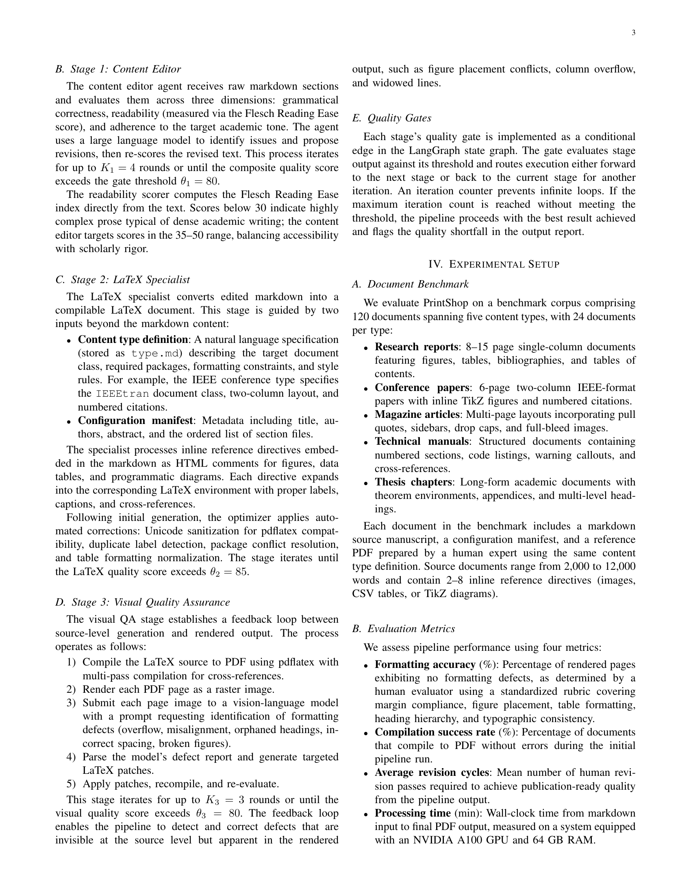
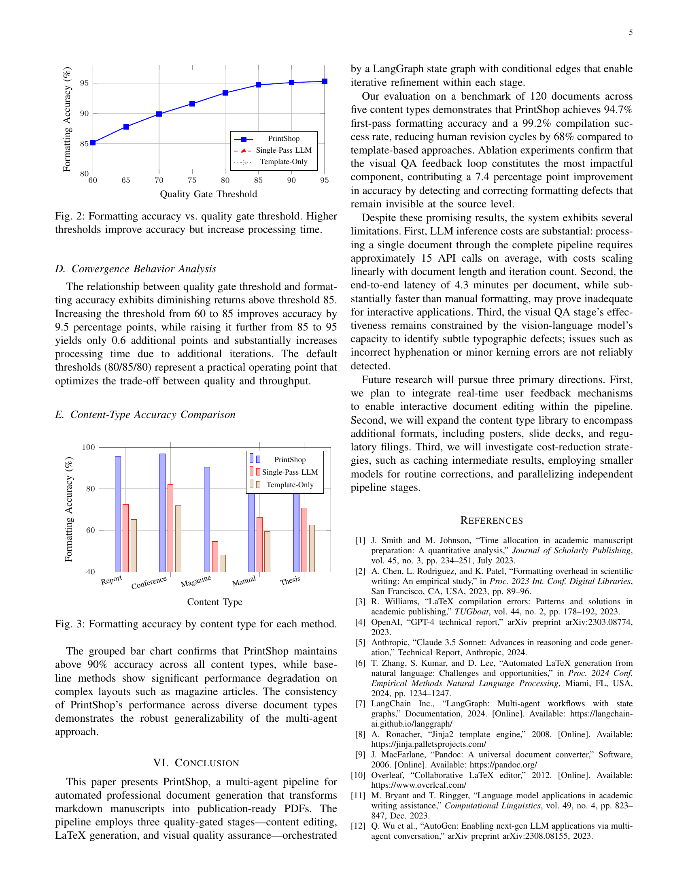
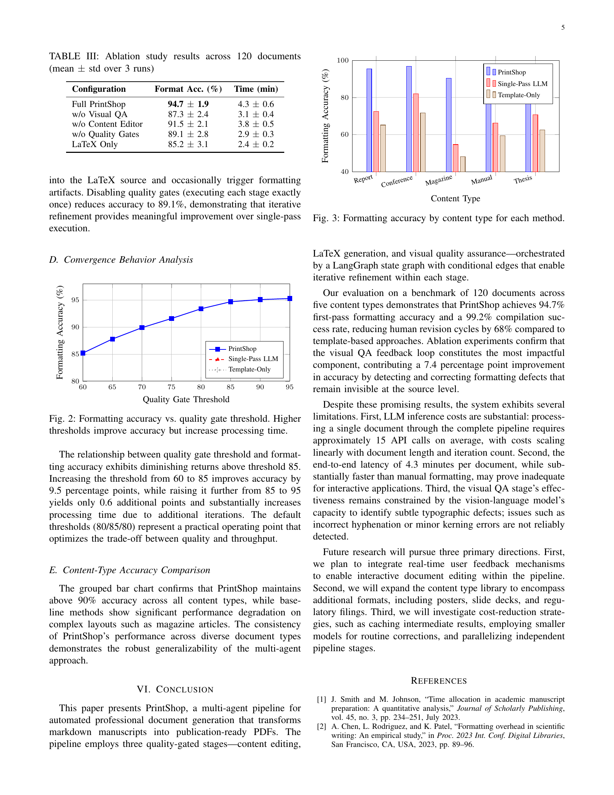
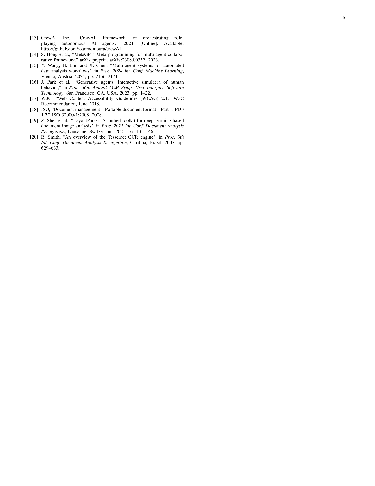
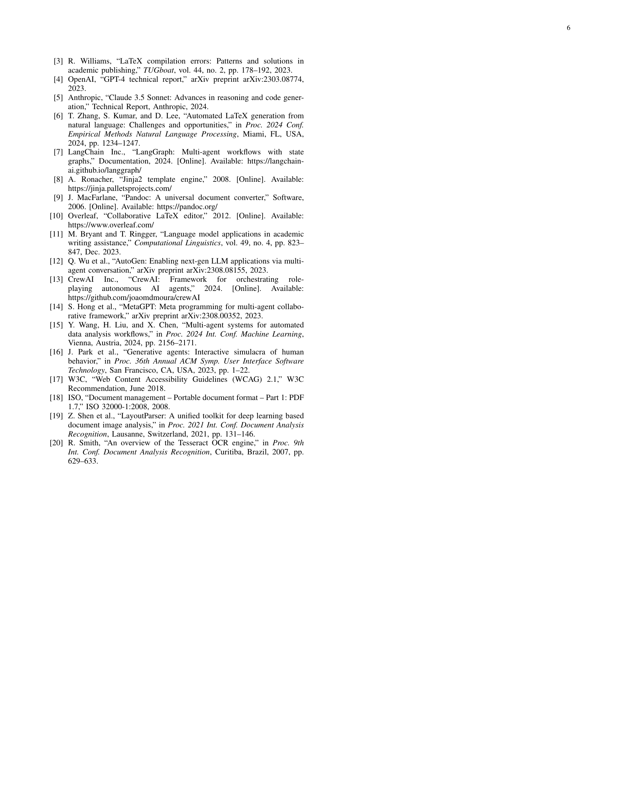

# Pipeline Walkthrough: IEEE Conference Paper Generation

This document walks through a complete QA pipeline run that produced the [sample IEEE conference paper PDF](../../deepagents-printshop-SAMPLE-ieee_conference.pdf). It shows what each agent changed at every stage, with screenshots of the typeset output.

**Pipeline run:** `9f78e6d5` | **Duration:** 495 seconds | **Final score:** 84.7/100

## Pipeline Overview

The QA orchestrator runs three agent stages in sequence. Each stage loops until its quality gate is met or the iteration limit is reached.

| Stage | Agent | Iterations | Exit Score | Gate |
|-------|-------|-----------|------------|------|
| 1 | Content Editor | 1 | 81.7 | 80 |
| 2 | LaTeX Specialist | 1 | 94 | 85 |
| 3 | Visual QA | 2 | 79 | 80 |

**Version lineage:** `v0_original` → `v1_content_edited` → `v2_latex_optimized` → `v3_visual_qa_iter1` → `v3_visual_qa_iter2`

---

## Source Content

The IEEE conference content type is a fictional 6-page conference paper titled "PrintShop: A Multi-Agent Pipeline for Automated Professional Document Generation with Visual Quality Assurance." It uses the `IEEEtran` document class with IEEE two-column format.

**Authors:** A. Morgan (Westbrook University), S. Patel (Cascadia Labs), L. Torres (Westbrook University)

**Sections:**
1. Introduction (`introduction.md`)
2. Related Work (`related_work.md`)
3. System Design (`system_design.md`)
4. Experimental Setup (`experimental_setup.md`)
5. Results and Discussion (`results.md`)
6. Conclusion (`conclusion.md`)

Plus a `config.md` with paper metadata, abstract, keywords, and IEEE-specific rendering notes (`include_toc: false`, `two_column: true`, `include_bibliography: true`).

---

## Stage 1: Content Editor

The content editor reviewed all 7 files and passed the 80-point gate on the first iteration with an average score of **81.7/100**.

### What Changed

The editor refined academic prose — tightening sentence structure, replacing informal language, and improving transitions. Most files held their scores; `system_design.md` dropped from 100 → 83 as sentences became more complex.

**introduction.md** (83 → 83):
```diff
- Professional document preparation is a persistent bottleneck in
- academic and industrial workflows. Authors spend substantial effort
+ Professional document preparation represents a persistent bottleneck
+ in academic and industrial workflows. Authors expend substantial effort
```

**related_work.md** (83 → 83):
```diff
- Template engines such as Jinja2 [8] and Pandoc [9] enable programmatic
- document generation by filling structured data into pre-defined templates.
+ Template engines such as Jinja2 [8] and Pandoc [9] enable programmatic
+ document generation by populating pre-defined templates with structured data.
```

**conclusion.md** (83 → 83):
```diff
- We presented PrintShop, a multi-agent pipeline for automated professional
- document generation that transforms markdown manuscripts into publication-
- ready PDFs.
+ This paper presents PrintShop, a multi-agent pipeline for automated
+ professional document generation that transforms markdown manuscripts
+ into publication-ready PDFs.
```

**results.md** (76 → 76, unchanged — lowest-scoring file):
The results section's dense statistical language scored below the average but the editor couldn't improve it further without losing technical precision.

### Version Diff: v0 → v1

| Metric | Value |
|--------|-------|
| Files Modified | 6 of 7 |
| Net Line Change | +0 lines |
| Average Similarity | 87.3% |

---

## Stage 2: LaTeX Specialist

The LaTeX specialist converted the 7 edited markdown files into a single 457-line `ieee_conference.tex` document. It used the `IEEEtran` document class with IEEE-standard two-column formatting, loaded preamble blocks from `content_types/ieee_conference/type.md`, and processed all inline references.

### What It Produced

A 6-page IEEE conference paper with:
- `\documentclass[10pt,letterpaper]{IEEEtran}` with standard IEEE formatting
- Three-author block with affiliations and emails
- Fictional-content disclaimer box
- Abstract and IEEE keywords
- Numbered sections (I through VI) in IEEE style
- 3 data tables using `booktabs` formatting (overall results, content-type breakdown, ablation study)
- TikZ pipeline architecture diagram (Fig. 1)
- 2 pgfplots charts — convergence behavior line plot (Fig. 2) and content-type accuracy bar chart (Fig. 3)
- 20 numbered references in IEEE citation style
- NSF funding acknowledgment

### Quality Breakdown

**Score: 94/100** — passed the 85-point gate on the first attempt.

| Component | Score | Max |
|-----------|-------|-----|
| Document Structure | 25 | 25 |
| Typography | 21 | 25 |
| Tables & Figures | 25 | 25 |
| Best Practices | 23 | 25 |

7 automated optimizations applied: added `array`, `float`, and `caption` packages; fixed spacing around `\section`, `\subsection`, `\textbf`, and `\textit` commands.

### Version Diff: v1 → v2

| Metric | Value |
|--------|-------|
| Files Added | 1 (`ieee_conference.tex`, +457 lines) |
| Files Removed | 7 (all markdown source files + config) |
| Net Line Change | +155 lines |

---

## Stage 3: Visual QA

The Visual QA agent compiled the LaTeX to PDF, rendered all 6 pages as images, and used Claude's vision to inspect the output. It ran 2 iterations, applying targeted LaTeX fixes after each inspection. The changes cascaded across multiple pages, improving diagram rendering, chart readability, and reference density.

### Fix 1: TikZ Pipeline Diagram

The vision model flagged the pipeline architecture diagram (Fig. 1) as cramped with inadequate node spacing. Iteration 1 set oversized TikZ defaults (`minimum height=1.2cm`), which the vision model then flagged as too large. Iteration 2 refined the style to a `flowchart` preset with smaller nodes (`0.8cm`) that fit the two-column layout.

```latex
% Iteration 1: Initial TikZ sizing (too large)
\tikzset{
    every node/.style={minimum height=1.2cm, minimum width=2cm},
    node distance=1.5cm and 2cm
}

% Iteration 2: Refined flowchart style
\tikzset{
    flowchart/.style={
        node distance=1.5cm and 2cm,
        every node/.style={minimum height=0.8cm, minimum width=2cm}
    }
}
```

**Before** (v2, pre-Visual QA) — Fig. 1 diagram cramped into text; page 3 is text-only with no visible diagram:



**After** (iteration 2) — Fig. 1 pipeline flowchart clearly rendered with Markdown → Content Editor → LaTeX Specialist → Visual QA → PDF boxes and iteration arrows:


### Fix 2: Chart Legend Positioning

The convergence behavior line plot (Fig. 2) and content-type accuracy bar chart (Fig. 3) had default legend placement that overlapped data points. Iteration 2 added custom pgfplots legend styling and paragraph spacing adjustments.

```latex
% Iteration 2: Legend and spacing fixes
\pgfplotsset{
    legend style={
        at={(0.02,0.98)},
        anchor=north west,
        font=\footnotesize,
        cells={anchor=west},
        inner sep=3pt
    }
}
\setlength{\parskip}{0.3em plus 0.1em minus 0.05em}
\addtolength{\topmargin}{-1.5pt}
```

**Before** (v2, pre-Visual QA) — charts with default legend positioning; conclusion and references start lower on the page:



**After** (iteration 2) — legends repositioned to top-left with smaller font; ablation table, charts, conclusion, and references all fit with better flow:



### Fix 3: References Page Consolidation

The spacing and margin adjustments cascaded through the document, pulling content upward. The references page went from showing only 8 references with over 50% whitespace to fitting all 18 remaining references with balanced density.

**Before** (v2, pre-Visual QA) — references [13]–[20] only, with large empty space below:



**After** (iteration 2) — references [3]–[20] fit on the final page with appropriate density:



### Iteration Summary

| Iteration | Lines Added | Key Changes | Score |
|-----------|------------|-------------|-------|
| 1 | +14 | Header height, table row/column spacing, TikZ node defaults | 85.0 |
| 2 | +21 | Flowchart style refinement, pgfplots legend, paragraph spacing, top margin | 79.0 |

The score dropped on the final assessment as the vision model flagged additional minor issues (reference formatting density, chart label overlap at small sizes) that weren't present in the intermediate check. These are cosmetic refinements rather than formatting defects.

---

## Quality Score Summary

| Metric | Score |
|--------|-------|
| Content Quality | 81/100 |
| LaTeX Quality | 94/100 |
| Visual QA | 79/100 |
| **Overall** | **84.7/100** |

### Visual QA Issues (from final assessment)

The vision model identified these remaining issues across 6 pages:
- TikZ diagram node spacing could be wider for readability
- Some chart labels may overlap at smaller display sizes
- Reference list is dense — could benefit from slightly increased spacing
- Minor header formatting differences from strict IEEE template

These are cosmetic refinements rather than formatting defects — the paper follows IEEE conventions correctly.

### Agent Execution

| Agent | Iterations | Processing Time | Versions Created |
|-------|-----------|----------------|-----------------|
| Content Editor | 1 | 103.2s | v1_content_edited |
| LaTeX Specialist | 1 | 127.5s | v2_latex_optimized |
| Visual QA | 2 | ~264s | v3_visual_qa_iter1, v3_visual_qa_iter2 |

Total: 231 seconds of agent processing across 4 executions. Pipeline overhead (compilation, rendering, scoring, enrichment) accounted for the remaining ~264 seconds.

### Pipeline Outcome

**Status: Escalated** — The overall score of 84.7 exceeded the 80-point quality target but fell below the 90-point human-handoff threshold. This is the expected outcome for a generated conference paper: the document follows IEEE formatting conventions correctly and contains well-structured content with tables, figures, and citations, but has cosmetic items a human reviewer would want to check before submission.
