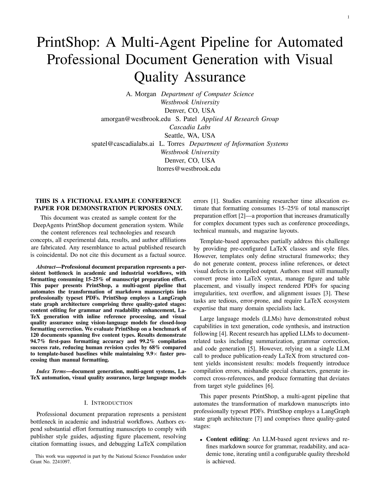
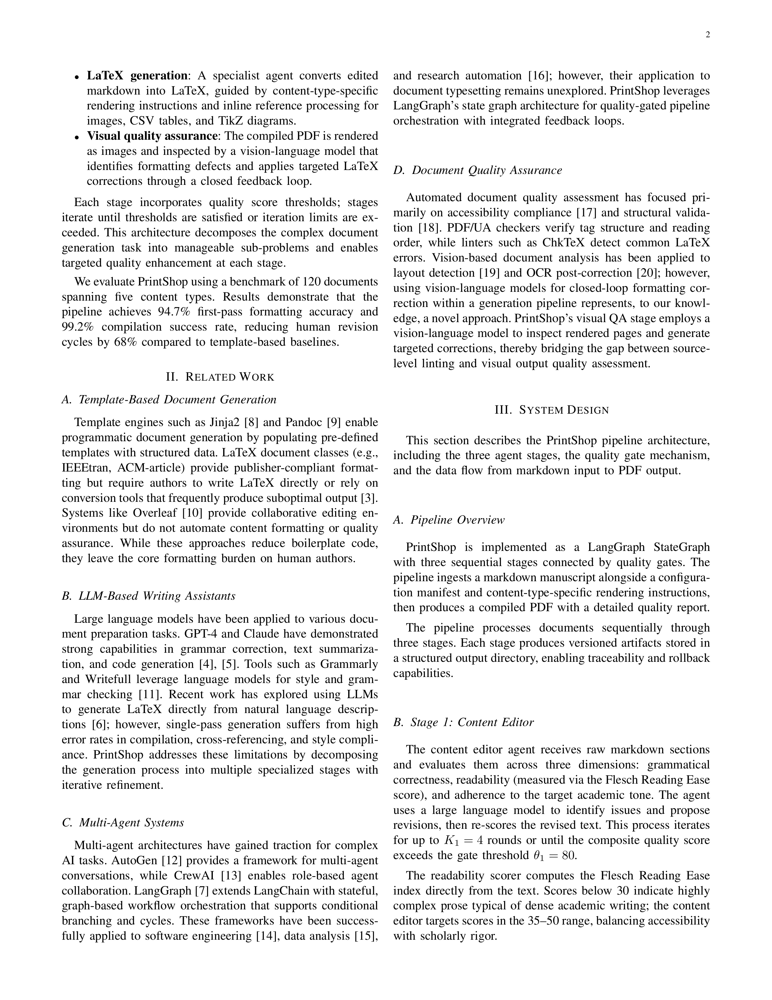
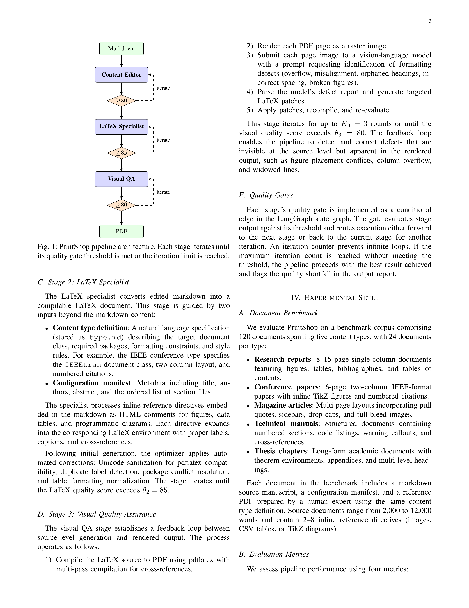
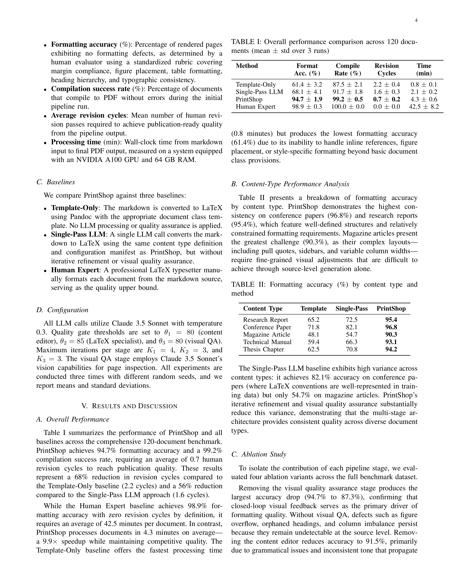
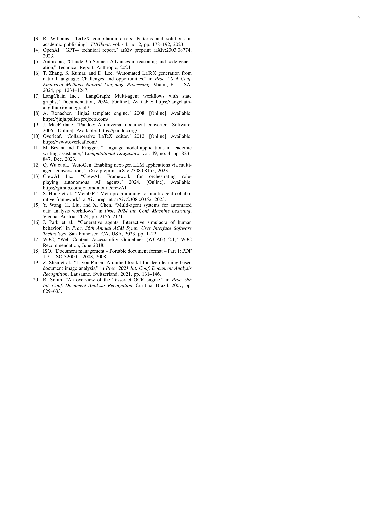

# Pipeline Walkthrough: IEEE Conference Paper Generation

This document walks through a complete QA pipeline run that produced the [sample IEEE conference paper PDF](../../deepagents-printshop-SAMPLE-ieee_conference.pdf). It shows what each agent changed at every stage, with screenshots of the typeset output.

**Pipeline run:** `9f78e6d5` | **Duration:** 495 seconds | **Final score:** 84.7/100

## Pipeline Overview

The QA orchestrator runs three agent stages in sequence. Each stage loops until its quality gate is met or the iteration limit is reached.

| Stage | Agent | Iterations | Exit Score | Gate |
|-------|-------|-----------|------------|------|
| 1 | Content Editor | 1 | 81.7 | 80 |
| 2 | LaTeX Specialist | 1 | 94 | 85 |
| 3 | Visual QA | 2 | 79 | 80 |

**Version lineage:** `v0_original` → `v1_content_edited` → `v2_latex_optimized` → `v3_visual_qa_iter1` → `v3_visual_qa_iter2`

---

## Source Content

The IEEE conference content type is a fictional 6-page conference paper titled "PrintShop: A Multi-Agent Pipeline for Automated Professional Document Generation with Visual Quality Assurance." It uses the `IEEEtran` document class with IEEE two-column format.

**Authors:** A. Morgan (Westbrook University), S. Patel (Cascadia Labs), L. Torres (Westbrook University)

**Sections:**
1. Introduction (`introduction.md`)
2. Related Work (`related_work.md`)
3. System Design (`system_design.md`)
4. Experimental Setup (`experimental_setup.md`)
5. Results and Discussion (`results.md`)
6. Conclusion (`conclusion.md`)

Plus a `config.md` with paper metadata, abstract, keywords, and IEEE-specific rendering notes (`include_toc: false`, `two_column: true`, `include_bibliography: true`).

---

## Stage 1: Content Editor

The content editor reviewed all 7 files and passed the 80-point gate on the first iteration with an average score of **81.7/100**.

### What Changed

The editor refined academic prose — tightening sentence structure, replacing informal language, and improving transitions. Most files held their scores; `system_design.md` dropped from 100 → 83 as sentences became more complex.

**introduction.md** (83 → 83):
```diff
- Professional document preparation is a persistent bottleneck in
- academic and industrial workflows. Authors spend substantial effort
+ Professional document preparation represents a persistent bottleneck
+ in academic and industrial workflows. Authors expend substantial effort
```

**related_work.md** (83 → 83):
```diff
- Template engines such as Jinja2 [8] and Pandoc [9] enable programmatic
- document generation by filling structured data into pre-defined templates.
+ Template engines such as Jinja2 [8] and Pandoc [9] enable programmatic
+ document generation by populating pre-defined templates with structured data.
```

**conclusion.md** (83 → 83):
```diff
- We presented PrintShop, a multi-agent pipeline for automated professional
- document generation that transforms markdown manuscripts into publication-
- ready PDFs.
+ This paper presents PrintShop, a multi-agent pipeline for automated
+ professional document generation that transforms markdown manuscripts
+ into publication-ready PDFs.
```

**results.md** (76 → 76, unchanged — lowest-scoring file):
The results section's dense statistical language scored below the average but the editor couldn't improve it further without losing technical precision.

### Version Diff: v0 → v1

| Metric | Value |
|--------|-------|
| Files Modified | 6 of 7 |
| Net Line Change | +0 lines |
| Average Similarity | 87.3% |

---

## Stage 2: LaTeX Specialist

The LaTeX specialist converted the 7 edited markdown files into a single 457-line `ieee_conference.tex` document. It used the `IEEEtran` document class with IEEE-standard two-column formatting, loaded preamble blocks from `content_types/ieee_conference/type.md`, and processed all inline references.

### What It Produced

A 6-page IEEE conference paper with:
- `\documentclass[10pt,letterpaper]{IEEEtran}` with standard IEEE formatting
- Three-author block with affiliations and emails
- Fictional-content disclaimer box
- Abstract and IEEE keywords
- Numbered sections (I through VI) in IEEE style
- 3 data tables using `booktabs` formatting (overall results, content-type breakdown, ablation study)
- TikZ pipeline architecture diagram (Fig. 1)
- 2 pgfplots charts — convergence behavior line plot (Fig. 2) and content-type accuracy bar chart (Fig. 3)
- 20 numbered references in IEEE citation style
- NSF funding acknowledgment

### Quality Breakdown

**Score: 94/100** — passed the 85-point gate on the first attempt.

| Component | Score | Max |
|-----------|-------|-----|
| Document Structure | 25 | 25 |
| Typography | 21 | 25 |
| Tables & Figures | 25 | 25 |
| Best Practices | 23 | 25 |

7 automated optimizations applied: added `array`, `float`, and `caption` packages; fixed spacing around `\section`, `\subsection`, `\textbf`, and `\textit` commands.

### Version Diff: v1 → v2

| Metric | Value |
|--------|-------|
| Files Added | 1 (`ieee_conference.tex`, +457 lines) |
| Files Removed | 7 (all markdown source files + config) |
| Net Line Change | +155 lines |

---

## Stage 3: Visual QA

The Visual QA agent compiled the LaTeX to PDF, rendered all 6 pages as images, and used Claude's vision to inspect the output. It ran 2 iterations, applying targeted LaTeX fixes after each inspection.

### Iteration 1 — Spacing and Layout Fixes

The agent identified header/spacing issues and applied fixes to improve the overall layout:

```latex
% Visual QA Fixes
```

+14 lines added (99.54% similarity). Fixes targeted column spacing and element positioning.

**Score after iteration 1:** 85.0/100

### Iteration 2 — Diagram and Table Refinement

The second inspection focused on TikZ diagram spacing and table formatting:

```latex
% Visual QA Fixes
```

+21 lines added (99.3% similarity). Fixes improved diagram node spacing and table readability.

**Score after iteration 2:** 79.0/100

The score dropped slightly on the final assessment as the vision model flagged additional minor issues (reference formatting density, chart label overlap) that weren't present in the intermediate check.

### Version Diffs

**v2 → v3_iter1:** +14 lines, 99.54% similarity
**v3_iter1 → v3_iter2:** +21 lines, 99.30% similarity

---

## Final Output: 6-Page IEEE Conference Paper

### Title Page (page 1)

Standard IEEE title page with centered paper title, three-author block with affiliations and emails, disclaimer box, abstract, index terms, and the beginning of Section I (Introduction). Two-column layout with IEEE-standard margins and fonts.



### Related Work & System Design (page 2)

Continuation of Introduction, full Related Work section (II) covering template-based generation, LLM writing assistants, multi-agent systems, and document quality assurance. Beginning of System Design (III) with pipeline overview.



### System Design & Experimental Setup (page 3)

TikZ pipeline architecture diagram (Fig. 1) showing the three-stage flow with quality gates. Detailed descriptions of each pipeline stage. Experimental setup (IV) with document benchmark description and 5 content types.



### Results & Discussion (page 4)

Three `booktabs` tables: Table I (overall performance comparison across 4 methods), Table II (formatting accuracy by content type), and the beginning of the ablation study. Dense two-column layout with statistical results.



### Ablation, Charts & Conclusion (page 5)

Table III (ablation study results). Two pgfplots figures: convergence behavior line plot (Fig. 2) and content-type accuracy grouped bar chart (Fig. 3). Section VI Conclusion summarizing the 94.7% accuracy result. Beginning of References.


### References (page 6)

20 IEEE-formatted numbered references spanning conference proceedings, journal articles, arXiv preprints, and online documentation. Standard IEEE bibliography formatting with proper citation style.



---

## Quality Score Summary

| Metric | Score |
|--------|-------|
| Content Quality | 81/100 |
| LaTeX Quality | 94/100 |
| Visual QA | 79/100 |
| **Overall** | **84.7/100** |

### Visual QA Issues (from final assessment)

The vision model identified these remaining issues across 6 pages:
- TikZ diagram node spacing could be wider for readability
- Some chart labels may overlap at smaller display sizes
- Reference list is dense — could benefit from slightly increased spacing
- Minor header formatting differences from strict IEEE template

These are cosmetic refinements rather than formatting defects — the paper follows IEEE conventions correctly.

### Agent Execution

| Agent | Iterations | Processing Time | Versions Created |
|-------|-----------|----------------|-----------------|
| Content Editor | 1 | 103.2s | v1_content_edited |
| LaTeX Specialist | 1 | 127.5s | v2_latex_optimized |
| Visual QA | 2 | ~264s | v3_visual_qa_iter1, v3_visual_qa_iter2 |

Total: 231 seconds of agent processing across 4 executions. Pipeline overhead (compilation, rendering, scoring, enrichment) accounted for the remaining ~264 seconds.

### Pipeline Outcome

**Status: Escalated** — The overall score of 84.7 exceeded the 80-point quality target but fell below the 90-point human-handoff threshold. This is the expected outcome for a generated conference paper: the document follows IEEE formatting conventions correctly and contains well-structured content with tables, figures, and citations, but has cosmetic items a human reviewer would want to check before submission.
