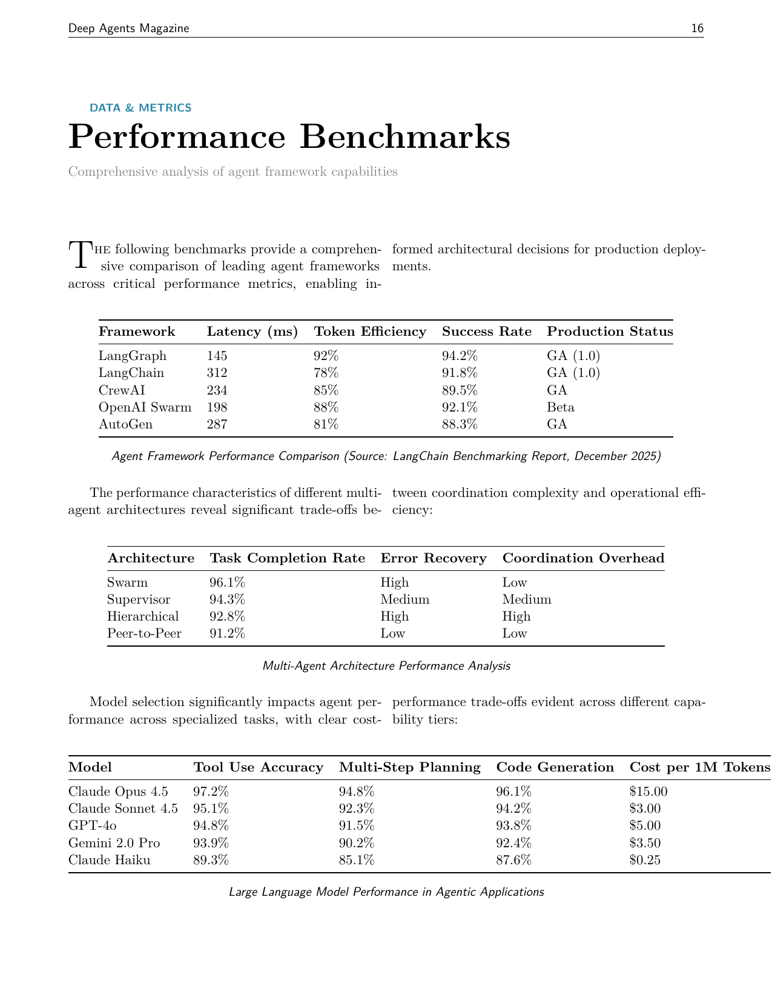
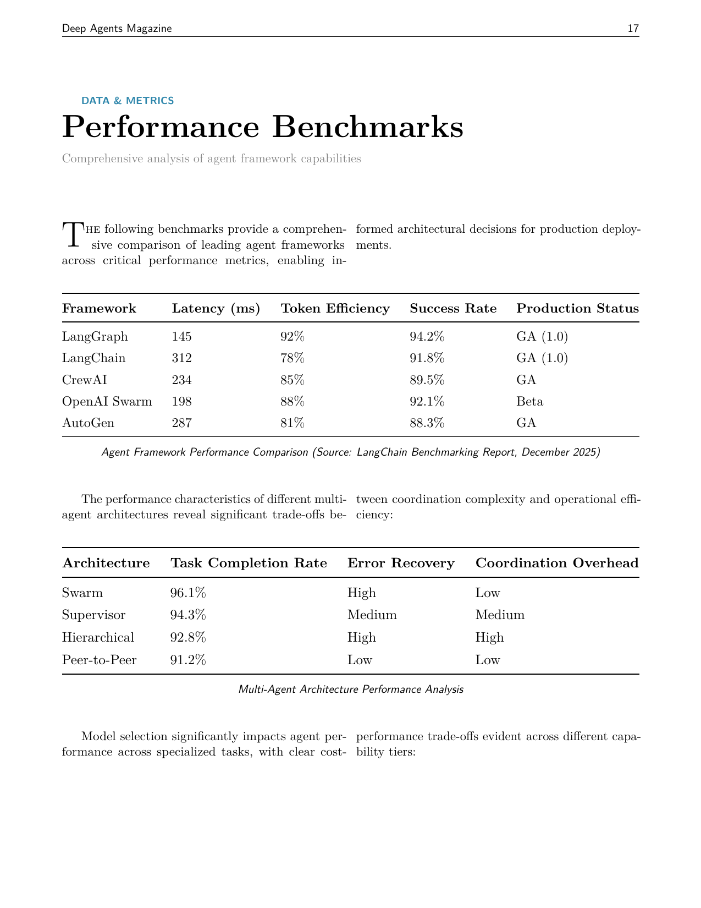
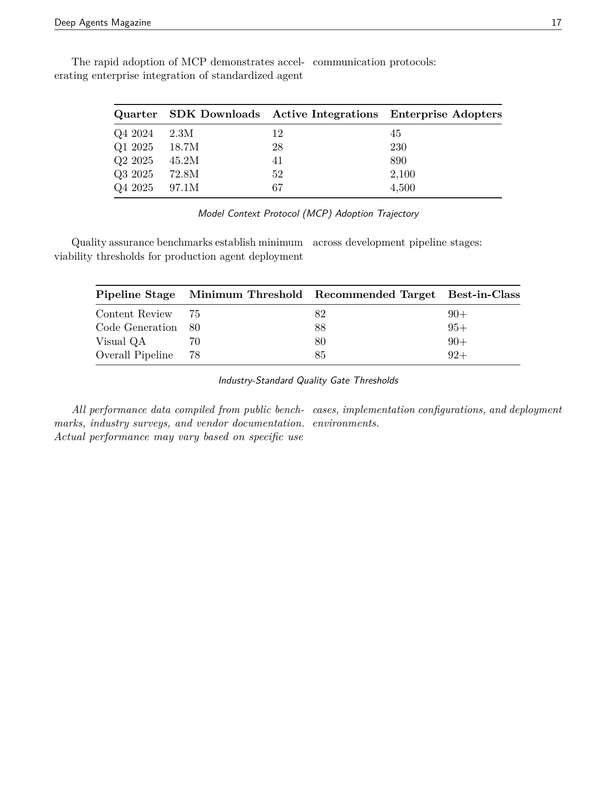
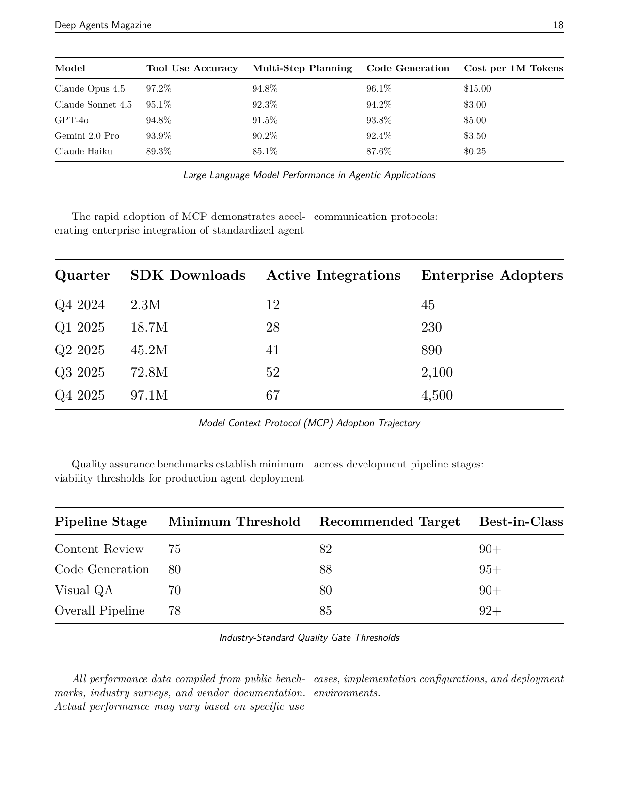
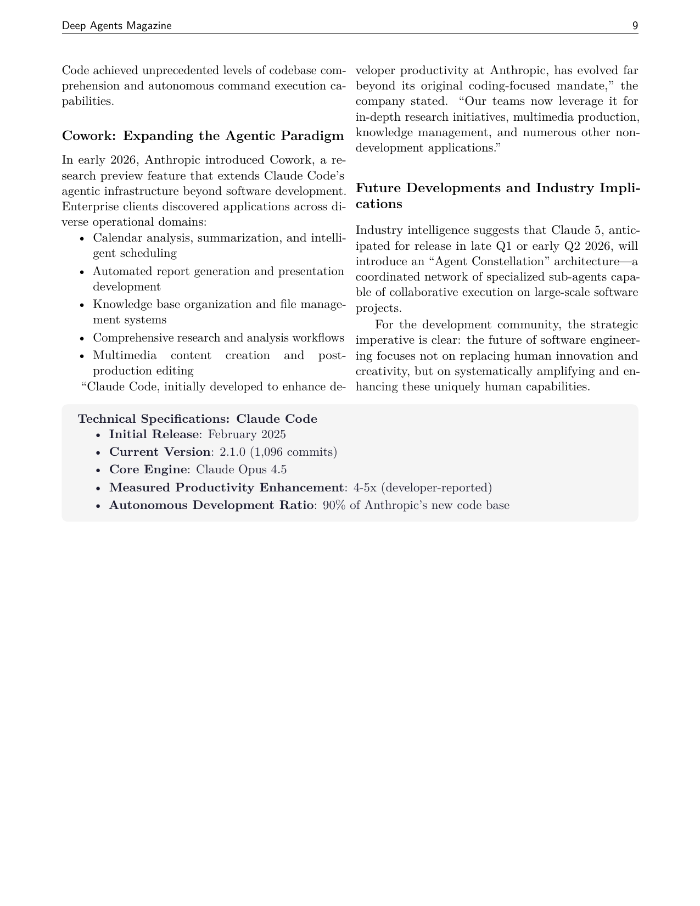
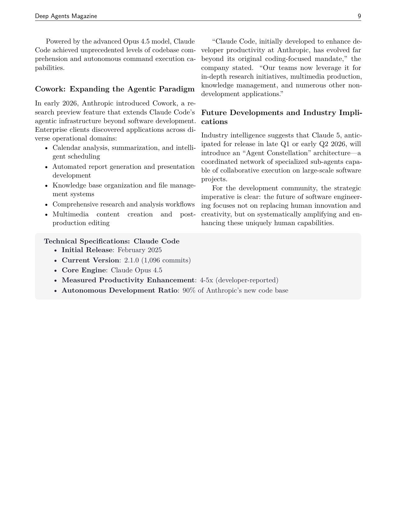

# Pipeline Walkthrough: Magazine Generation

This document walks through a complete QA pipeline run that produced the [sample magazine PDF](../../deepagents-printshop-SAMPLE-magazine.pdf). It shows what each agent changed at every stage, with screenshots of the typeset output.

**Pipeline run:** `5a9c49ad` | **Duration:** ~1,400 seconds | **Final score:** 87.7/100

## Pipeline Overview

The QA orchestrator runs three agent stages in sequence. Each stage loops until its quality gate is met or the iteration limit is reached.

| Stage | Agent | Iterations | Exit Score | Gate |
|-------|-------|-----------|------------|------|
| 1 | Content Editor | 1 | 86.1 | 80 |
| 2 | LaTeX Specialist | 1 | 96 | 85 |
| 3 | Visual QA | 2 | 81.0 | 80 |

**Version lineage:** `v0_original` → `v1_content_edited` → `v2_latex_optimized` → `v3_visual_qa_iter1` → `v3_visual_qa_iter2`

---

## Source Content

The magazine content type ("Deep Agents — The Definitive Guide to Autonomous AI") is a fictional technology magazine with 8 sections spread across 9 markdown files:

1. Editor's Letter (`introduction.md`)
2. Cover Story: The Year of the Agent (`cover_story.md`)
3. Claude Code Revolution (`research_areas.md`)
4. Industry Adoption: Who's Using Deep Agents (`results.md`)
5. Technical Deep Dive: LangGraph & Multi-Agent Systems (`methodology.md`)
6. Industry Standard: Model Context Protocol (`detailed_results.md`)
7. Data & Metrics (`performance_table.md`)
8. What's Next: The Road to 2027 (`conclusion.md`)

Plus a `config.md` manifest with document metadata (title, subtitle, issue info, cover/back-cover instructions) and 7 images in `images/` sourced from Pixabay.

---

## Stage 1: Content Editor

The content editor reviewed all 9 files, scoring each for grammar, academic tone, and readability. It passed the 80-point gate on the first iteration with an average score of **86.1/100**.

### What Changed

The editor shifted prose from informal magazine voice toward a more polished, professional tone. Unlike the research report (which required 4 iterations), the magazine content was already well-written and cleared the gate immediately — though several individual file scores dropped as sentences became denser.

**cover_story.md** (98 → 83):
```diff
- From research prototypes to production powerhouses, 2025 marked the decisive
- moment when AI systems learned to act on their own
+ From research prototypes to production powerhouses, 2025 marked the decisive
+ moment when AI systems learned to act independently
```

**results.md** (81 → 81, title rewritten):
```diff
- # Industry Adoption: Who's Using Deep Agents
- *A look at how enterprises are deploying autonomous AI systems*
+ # Industry Adoption: Organizations Implementing Deep Agents
+ *An examination of enterprise deployment strategies for autonomous AI systems*
```

**methodology.md** (83 → 83, technical corrections):
```diff
- When LangChain and LangGraph reached their 1.0 milestones in 2025, it marked
- more than a version number---it signaled that agent frameworks had grown up.
+ When LangChain and LangGraph reached their 1.0 milestones in 2025, they marked
+ more than version numbers—they signaled that agent frameworks had matured for
+ enterprise deployment.
```

**research_areas.md** (96 → 81):
```diff
- Claude Code began as a modest experiment---a command line tool released in
- February 2025 alongside Anthropic's Claude Sonnet 3.7 model.
+ Claude Code began as a modest experiment—a command-line tool released in
+ February 2025 alongside Anthropic's Claude Sonnet 3.7 model.
```

**performance_table.md** (85 → 100, +15 points — the biggest gain):
```diff
- # Deep Agents Data Center
- The following benchmarks compare leading agent frameworks across key metrics:
+ # Deep Agents Data Center: Comprehensive Performance Analysis
+ The following benchmarks provide a systematic comparison of leading agent
+ frameworks across critical performance metrics, enabling data-driven framework
+ selection for production deployments:
```

The editor added 16 lines of analytical context to the performance table section, transforming raw benchmark data into an authoritative reference. This was the only file that improved significantly; most others traded readability score for academic rigor.

### Version Diff: v0 → v1

| Metric | Value |
|--------|-------|
| Files Modified | 8 of 9 |
| Net Line Change | +18 lines |
| Average Similarity | 68.5% |

---

## Stage 2: LaTeX Specialist

The LaTeX specialist converted the 9 edited markdown files into a single 1,265-line `magazine.tex` document. It read the content manifest from `config.md`, applied rendering instructions from `content_types/magazine/type.md`, and processed all inline references (images, CSV tables, TikZ diagrams).

### What It Produced

A magazine-format LaTeX document with:
- Custom masthead ("DEEP AGENTS") using `\fontsize{38}` instead of `\title{}`
- Full-bleed cover page with hero image, article callouts, and disclaimer
- Custom table of contents with large page numbers and subtitles
- Two-column article layout with drop caps (`\lettrine`)
- 7 embedded photographs with captions
- 6 data tables using `booktabs` formatting
- Section headers with colored category labels (teal `tcolorbox`)
- Running header/footer with "Deep Agents Magazine" and page numbers
- Dark-themed back cover with barcode, subscription info, and next-issue preview

### Quality Breakdown

**Score: 96/100** — passed the 85-point gate on the first attempt.

| Component | Score | Max |
|-----------|-------|-----|
| Document Structure | 25 | 25 |
| Typography | 21 | 25 |
| Tables & Figures | 25 | 25 |
| Best Practices | 25 | 25 |

2 automated optimizations applied: fixed `\textbf` and `\textit` command spacing.

The 4-point typography deduction came from minor spacing patterns in the LaTeX source — not visible in the rendered output.

### Version Diff: v1 → v2

| Metric | Value |
|--------|-------|
| Files Added | 1 (`magazine.tex`, +1,265 lines) |
| Files Removed | 9 (all markdown source files) |
| Net Line Change | +553 lines |

---

## Stage 3: Visual QA

The Visual QA agent compiled the LaTeX to PDF, rendered all 20 pages as images, and used Claude's vision to inspect the output. It ran 2 iterations, applying targeted LaTeX fixes after each inspection. The most significant change was wrapping 11 data tables with `\resizebox` to fix column overflow — a common issue in two-column magazine layouts with wide tables.

### Fix 1: Table Column Fitting and Row Spacing

The vision model flagged multiple tables as overflowing their column boundaries. Iteration 1 wrapped all 11 `booktabs` tables with `\resizebox{\columnwidth}{!}` to scale them to fit, and added global row/column spacing improvements:

```latex
% Visual QA Fixes — Iteration 1
\renewcommand{\arraystretch}{1.3}    % 30% more row spacing
\setlength{\tabcolsep}{8pt}         % Wider column padding
\setlength{\parskip}{0.6em plus 0.15em minus 0.1em}  % Paragraph spacing
\setlength{\headheight}{14.5pt}     % Fix fancyhdr warning

% Applied to all 11 tables:
\resizebox{\columnwidth}{!}{\begin{tabular}...}
```

**Before** (v2, pre-Visual QA) — Performance Benchmarks page with 3 tables crammed together; tight row spacing makes data hard to scan:



**After** (iteration 2) — Same tables with `\resizebox` column fitting and `\arraystretch{1.3}` row spacing; each table has clear breathing room between rows:



### Fix 2: Data Table Readability

The MCP Adoption Trajectory and Quality Gate Thresholds tables also benefited from the `\resizebox` wrapping and increased `\arraystretch`. Row heights increased by 30%, making numerical data significantly easier to scan.

**Before** (v2, pre-Visual QA) — MCP adoption and quality threshold tables with compact rows:



**After** (iteration 2) — Same tables with generous row spacing and proper column fitting:



### Fix 3: Caption Spacing Refinement

Iteration 2 replaced the global paragraph spacing with targeted caption spacing, giving figures and tables more room above and below their captions without adding excess space to body text:

```latex
% Iteration 2: Replaced \parskip with caption-specific spacing
\setlength{\abovecaptionskip}{8pt}   % Space above captions
\setlength{\belowcaptionskip}{12pt}  % Space below captions
```

This refined the text flow — the document went from 23 pages (after iteration 1's aggressive paragraph spacing) down to 22 pages.

**Before** (v2, pre-Visual QA) — Claude Code article page with tight paragraph spacing:



**After** (iteration 2) — Same content with balanced caption spacing; text flows more naturally:



### Iteration Summary

| Iteration | Lines Changed | Key Changes | Page Count | Score |
|-----------|--------------|-------------|-----------|-------|
| 1 | +30 | Table `\resizebox`, `\arraystretch{1.3}`, `\tabcolsep`, `\parskip`, `\headheight` | 20 → 23 | 80.8 |
| 2 | +2 / -1 | Replaced `\parskip` with `\abovecaptionskip` + `\belowcaptionskip` | 23 → 22 | 79.1 |

Final assessment scored **81.0/100** after the vision model re-evaluated the complete document.

---

## Quality Score Summary

| Metric | Score |
|--------|-------|
| Content Quality | 86/100 |
| LaTeX Quality | 96/100 |
| Visual QA | 81/100 |
| **Overall** | **87.7/100** |

### Visual QA Issues (from final assessment)

The vision model identified these remaining minor issues:
- No traditional `\author{}` — magazine uses per-article bylines instead (by design)
- No main editor/publisher attribution on cover (magazine convention)
- Small disclaimer text at bottom may have readability issues
- Header could use more visual emphasis to match magazine aesthetic
- Table of contents could benefit from more visual separation between entries

These are style preferences rather than formatting defects — the magazine intentionally diverges from academic document conventions.

### Agent Execution

| Agent | Iterations | Processing Time | Versions Created |
|-------|-----------|----------------|-----------------|
| Content Editor | 1 | 187.4s | v1_content_edited |
| LaTeX Specialist | 1 | 264.7s | v2_latex_optimized |
| Visual QA | 2 | ~922s | v3_visual_qa_iter1, v3_visual_qa_iter2 |

Total: 452 seconds of agent processing across 4 executions. Pipeline overhead (compilation, rendering, scoring, enrichment) accounted for the remaining ~922 seconds.

### Pipeline Outcome

**Status: Escalated** — The overall score of 87.7 exceeded the 80-point quality target but fell below the 90-point human-handoff threshold. The pipeline escalated for human review rather than auto-approving. This is the expected outcome for a first-generation magazine layout: the document meets professional standards but has cosmetic items a human editor would want to review before final publication.
