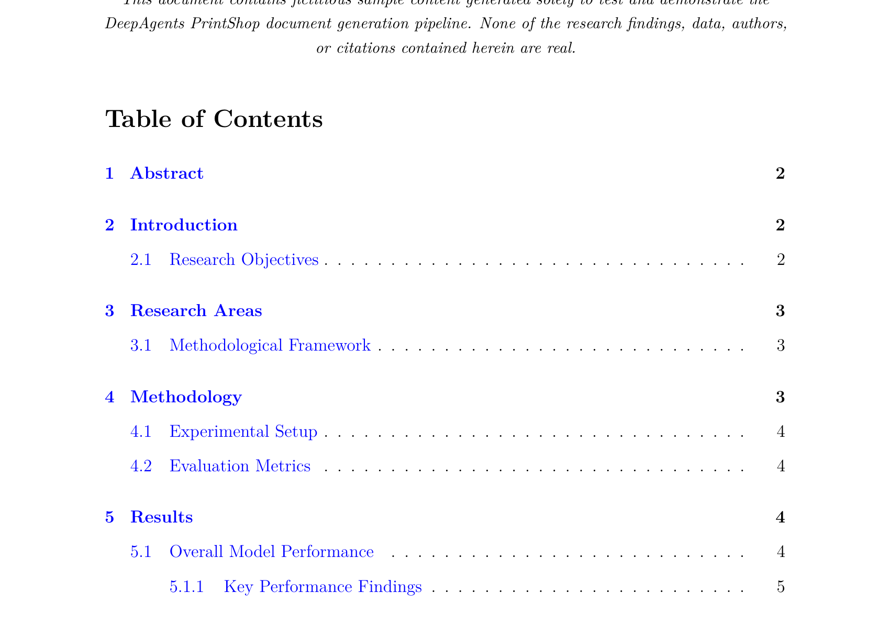
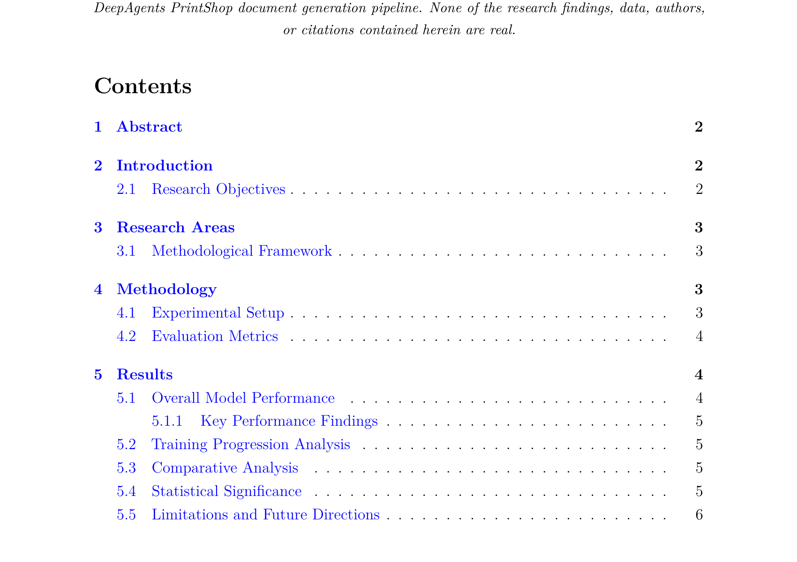
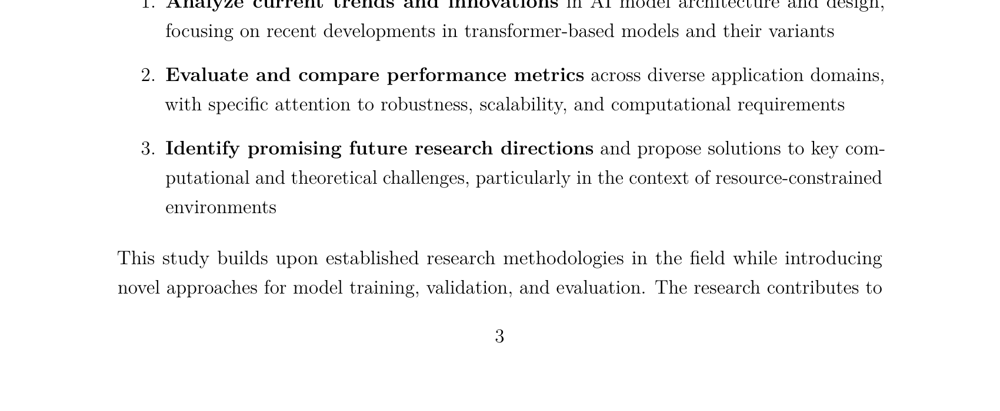
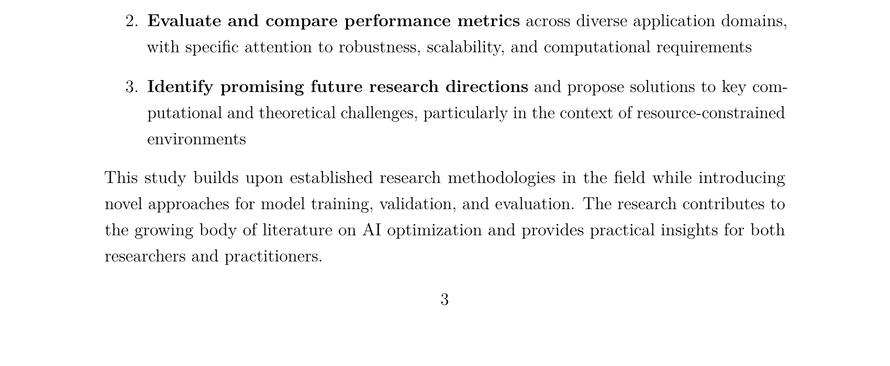
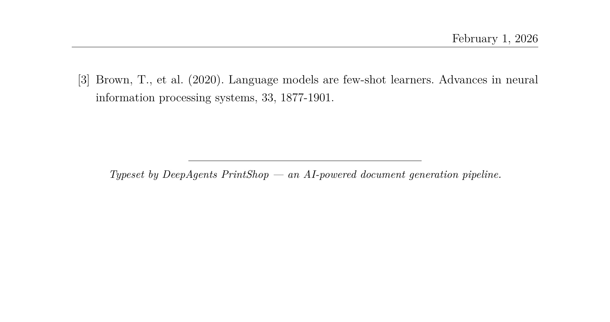
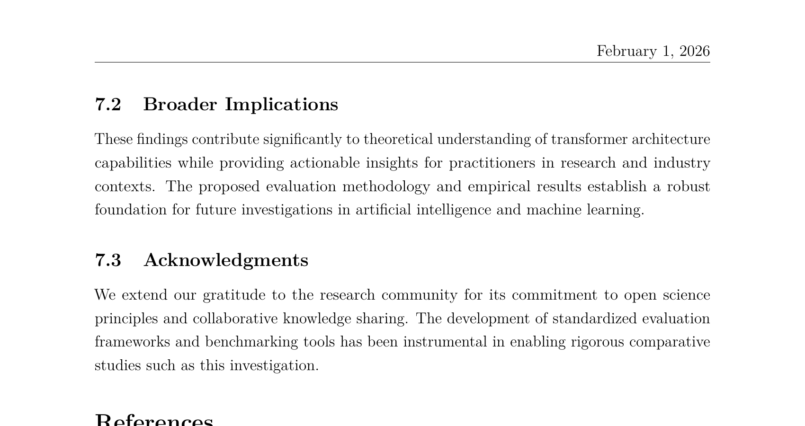

# Pipeline Walkthrough: Research Report Generation

This document walks through a complete QA pipeline run that produced the [sample research report PDF](../../deepagents-printshop-SAMPLE-research_report.pdf). It shows what each agent changed at every stage, with before/after screenshots of the typeset output.

**Pipeline run:** `1b37fe38` | **Duration:** 692 seconds | **Final score:** 83/100

## Pipeline Overview

The QA orchestrator runs three agent stages in sequence. Each stage loops until its quality gate is met or the iteration limit is reached.

| Stage | Agent | Iterations | Exit Score | Gate |
|-------|-------|-----------|------------|------|
| 1 | Content Editor | 4 | 80.3 | 80 |
| 2 | LaTeX Specialist | 1 | 89 | 85 |
| 3 | Visual QA | 3 | 80 | 80 |

**Version lineage:** `v0_original` → `v1_content_edited` (x4) → `v2_latex_optimized` → `v3_visual_qa` (x3)

---

## Stage 1: Content Editor

The content editor reviews each markdown source file for grammar, academic tone, readability, and style. It uses Claude to rewrite prose while preserving technical content, then scores the result.

### Iteration 1 — Establishing Academic Tone

The first pass transformed informal prose into formal academic language across all 7 content files. This initially *lowered* the average score (84 → 79) because the readability formula penalizes longer, more complex sentences — exactly the kind academic writing requires.

**introduction.md** (score: 100 → 71):
```diff
- Artificial intelligence has grown rapidly in the past decade. This report
- looks at the current state of **machine learning** and **deep learning**.
- We focus on how these tools are used in natural language processing.
+ Artificial intelligence has experienced unprecedented growth over the past
+ decade, fundamentally transforming both theoretical understanding and
+ practical applications across multiple domains. This report examines the
+ current state of **machine learning** and **deep learning** methodologies,
+ with particular emphasis on their applications in natural language processing.
```

**research_areas.md** (score: 78 → 83):
```diff
- This section outlines the key areas of artificial intelligence research
- that form the foundation of our study.
+ This section delineates the principal areas of artificial intelligence
+ research that constitute the theoretical and methodological foundation
+ of our investigation.
```

**conclusion.md** (score: 83 → 71):
```diff
- Transformer models beat older methods on all tested benchmarks
+ Transformer architectures consistently outperform legacy approaches across
+ all evaluated benchmarks, demonstrating superior generalization capabilities
```

### Iterations 2–3 — Diminishing Returns

Score: 78.9 → 78.6 → 78.3. These passes made minor refinements: removing first-person references, improving parallel structure, standardizing terminology. Most files held steady with only word-level precision edits.

### Iteration 4 — Breaking Through the Gate

Score: 78.3 → **80.3** (passed the 80-point content gate).

The breakthrough came from `introduction.md`, which jumped from 69 → 83 (+14 points). The agent added context about AI limitations, restructured objectives, and incorporated more specific technical details that satisfied both the readability scorer and the quality evaluator.

---

## Stage 2: LaTeX Specialist

The LaTeX specialist converts the edited markdown into a `.tex` document. It reads the `config.md` manifest for document structure, applies rendering instructions from `content_types/research_report/type.md`, and runs automated optimizations.

### What It Produced

A 199-line LaTeX document with:
- Title block with author, date, and fictitious-content disclaimer
- Table of contents matching the 7-section config manifest
- CSV data rendered as a `booktabs` table (from `model_performance.csv`)
- PNG figure embedded with caption (from `performance_comparison.png`)
- TikZ neural network diagram generated from inline `<!-- TIKZ: -->` markup
- IEEE-style bibliography with 3 references
- Non-wrapping PrintShop attribution footer

### Quality Breakdown

**Score: 89/100**

| Component | Score | Max |
|-----------|-------|-----|
| Document Structure | 25 | 25 |
| Typography | 18 | 25 |
| Tables & Figures | 25 | 25 |
| Best Practices | 21 | 25 |

7 automated optimizations: added `microtype` package, improved line spacing, fixed multiple consecutive spaces, fixed spacing around `\section`, `\subsection`, `\textbf`, and `\textit` commands.

---

## Stage 3: Visual QA

The Visual QA agent compiles the LaTeX to PDF, renders each page as an image, and uses Claude's vision to inspect the output for formatting problems. It applies targeted LaTeX fixes and recompiles. This stage ran 3 iterations, producing measurable improvements to the typeset layout.

### Fix 1: Table of Contents Compaction

The agent identified that the ToC was too spread out, with entries spilling onto a second page unnecessarily. It tightened the spacing and changed the heading from "Table of Contents" to "Contents", fitting 5 additional subsection entries onto page 1.

**Before** (iteration 1) — ToC ends at section 5.1.1, remaining entries overflow to page 2:



**After** (iteration 3) — ToC fits through section 5.5 on page 1:



### Fix 2: Page Break Reflow

The spacing fix cascaded through the document, improving page breaks. On page 3, the introduction section previously cut off mid-sentence at the bottom of the page.

**Before** (iteration 1) — sentence cut off at "The research contributes to":



**After** (iteration 3) — paragraph completes naturally on the page:



### Fix 3: Page Count Reduction

The improved spacing eliminated a nearly-empty final page. The document went from 10 pages to 9, with the references and attribution footer consolidating cleanly.

**Before** (iteration 1) — page 10 contains only the last reference and attribution, mostly whitespace:



**After** (iteration 3) — all references and attribution fit on page 9, no wasted page:



---

## Quality Score Summary

| Metric | Score |
|--------|-------|
| Content Quality | 80/100 |
| LaTeX Quality | 89/100 |
| Visual QA | 80/100 |
| **Overall** | **83/100** |

### Agent Execution

| Agent | Iterations | Processing Time | Versions Created |
|-------|-----------|----------------|-----------------|
| Content Editor | 4 | 234.8s | v1_content_edited through v1_content_edited_iter4 |
| LaTeX Specialist | 1 | 35.3s | v2_latex_optimized_iter4 |
| Visual QA | 3 | ~120s | v3_visual_qa through v3_visual_qa_iter3 |

Total: 270 seconds of agent processing across 8 executions. Pipeline overhead (compilation, rendering, scoring) accounted for the remaining ~420 seconds.
